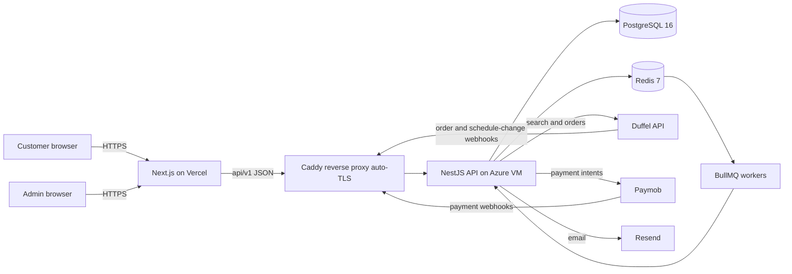

# TravelHub · سفريات (Safariyat)

> A production, Arabic-first **flight-booking platform** — live flight inventory, real card payments, passwordless sign-in, generated e-ticket PDFs, and a full operations console.

**Live:** [www.safariyat.live](https://www.safariyat.live) · **API:** [api.safariyat.live](https://api.safariyat.live)

TravelHub is a full-stack travel product built around real supplier integrations rather than mocks: flights come from the **Duffel** API, payments run through **Paymob**, and the whole post-booking lifecycle (order fulfillment, e-ticketing, schedule changes, cancellations, refunds, and a supplier/customer ledger) is modelled as an explicit state machine with queue-backed reconciliation. The customer app is a right-to-left Arabic Next.js frontend; a role-gated admin console handles bookings, refunds, users, markup rules, support tickets, and the ledger.

---

## Table of contents

- [Tech stack](#tech-stack)
- [Architecture](#architecture)
- [Repository layout](#repository-layout)
- [Backend (NestJS API)](#backend-nestjs-api)
- [Frontend (Next.js app)](#frontend-nextjs-app)
- [Data & infrastructure](#data--infrastructure)
- [Authentication model](#authentication-model)
- [Local development](#local-development)
- [Environment variables](#environment-variables)
- [Deployment](#deployment)
- [Testing](#testing)
- [Documentation](#documentation)
- [Roadmap](#roadmap)

---

## Tech stack

| Layer | Technology |
|---|---|
| **Frontend** | Next.js 16 (App Router), React 19, TypeScript, Tailwind CSS 4 — RTL / Arabic-first |
| **Backend** | NestJS 11, TypeScript, TypeORM |
| **Database** | PostgreSQL 16 |
| **Cache / queues** | Redis 7 + BullMQ (background jobs, rate-limit windows, idempotency locks) |
| **Suppliers** | Duffel (flight search, orders, webhooks) · Paymob (payments) · Resend (transactional email) |
| **Auth** | Google OAuth 2.0 (PKCE) + passwordless magic links · JWT access + httpOnly refresh cookie |
| **Docs / PDFs** | pdfkit + qrcode (server-rendered bilingual e-tickets) |
| **Hosting** | Frontend on Vercel · Backend on an Azure VM (Docker Compose + Caddy auto-TLS) · CI/CD via GitHub Actions |

---

## Architecture



Key flows:

- **Booking lifecycle** is an explicit state machine (`awaiting_payment → paid → confirmed`, plus `order_failed`, `cancelled`, `refunded`). See [`docs/booking_state_machine.md`](docs/booking_state_machine.md).
- **Order fulfillment is queue-backed.** After payment, a BullMQ job creates the Duffel order; the fast path is the `order.created` webhook, with a periodic reconciliation sweep as the safety net for ambiguous supplier outcomes.
- **Idempotency & no double-charges** — Redis locks guard booking creation; supplier calls carry idempotency keys; webhook events are de-duplicated via a `processed_at` sweep pattern.

---

## Repository layout

```
travel-platform/
├── app/
│   ├── Backend/            # NestJS API (TypeScript, TypeORM)
│   │   ├── src/            # feature modules (see below)
│   │   ├── assets/fonts/   # Noto Naskh Arabic (for RTL e-ticket PDFs)
│   │   └── Dockerfile
│   └── web/                # Next.js 16 App Router frontend (Arabic RTL)
│       └── src/app/        # file-system routes (see below)
├── docs/                   # PRD, ERD, API contract, state machine, deployment, …
├── .github/                # CI/CD workflows
├── docker-compose.yml      # local dev: Postgres + Redis
├── docker-compose.prod.yml # production stack: backend + Postgres + Redis + Caddy
├── Caddyfile               # reverse proxy + automatic HTTPS
└── CONTRIBUTING.md         # branch / commit / PR conventions
```

---

## Backend (NestJS API)

All routes are served under the `/api/v1` prefix (except `/health`). Global concerns: Helmet, strict CORS (frontend origin only, credentials), request-scoped IDs, structured JSON logging in production, a global exception filter producing a consistent error envelope, and per-IP throttling.

| Module | Responsibility | Main routes |
|---|---|---|
| `auth` | Google OAuth (PKCE) + magic-link sign-in, JWT issue/refresh, account resolution, current user | `POST /auth/*`, `GET /me` |
| `flights` | Duffel-backed flight search & offer detail | `GET /flights/*` |
| `bookings` | Booking creation, passengers, order fulfillment, cancellation quotes/cancel, e-ticket PDF, Duffel webhooks | `.../bookings/*`, `POST /webhooks/duffel` |
| `payments` | Paymob payment intents + payment webhooks | `.../bookings/:id/pay*`, `POST /webhooks/paymob` |
| `ledger` | Double-entry-style supplier/customer ledger | `GET /admin/ledger` |
| `support` | Customer support tickets + admin queue | `.../support/tickets`, `.../admin/support/tickets` |
| `admin` | Ops console APIs: bookings, users, refunds, markup rules, audit logs (role-gated) | `.../admin/*` |
| `users` | User entity & roles | — |
| `common` | Cross-cutting: DTOs, filters, logging, middleware | — |
| `database` / `redis` / `health` | TypeORM data source & migrations, Redis client, liveness/readiness probes | `GET /health` |

Background workers (BullMQ): order fulfillment, Duffel/Paymob webhook processing, refund execution, plus scheduled sweeps for reconciliation, expiry, webhook retries, and magic-link token purging.

---

## Frontend (Next.js app)

Right-to-left, Arabic-first UI on the App Router. Notable routes:

| Area | Routes |
|---|---|
| **Customer** | `/` (landing + search) · `/flights` · `/checkout/payment` · `/checkout/payment-return` · `/checkout/confirmation` · `/bookings/[id]` · `/user-dashboard` · `/support` |
| **Auth** | `/signin` · `/auth/verify` (magic link) · `/auth/callback` (OAuth) |
| **Admin console** | `/admin` · `/admin/bookings` · `/admin/users` · `/admin/refunds` · `/admin/ledger` · `/admin/markup-rules` · `/admin/support` · `/admin/audit-logs` |
| **Legal** | `/privacy` · `/terms` |

Includes SEO/GEO metadata, sitemap/robots, JSON-LD, and an `llms.txt`.

---

## Data & infrastructure

- **PostgreSQL** — users & auth identities, bookings, flight-offer snapshots (slices/segments), passengers, documents (e-tickets), payments, refunds, ledger entries, markup rules, support tickets, audit logs, and webhook-event tables. Schema is managed with **TypeORM migrations** (auto-run on deploy). See [`docs/erd.md`](docs/erd.md).
- **Redis** — BullMQ job queues, sliding-window rate limits, and idempotency locks.
- Flight times are stored as **airport-local wall-clock** timestamps (never UTC-normalized) to match how airlines publish schedules.

---

## Authentication model

- **Two ways in:** Google OAuth 2.0 with PKCE, or a passwordless **magic link** emailed to the user (15-minute, single-use, hashed at rest, rate-limited per email and per IP).
- **Sessions:** short-lived JWT access token + a long-lived refresh token in an httpOnly cookie.
- **Roles today:** `user` and `technical_admin` (the admin console is role-gated via a `RolesGuard`). A richer multi-tenant agency role model is on the roadmap.

Details and the same-email race handling are in [`docs/auth_flow.md`](docs/auth_flow.md).

---

## Local development

**Prerequisites:** Node.js 20+, Docker (for Postgres + Redis).

```bash
# 1. Start the datastores
docker compose up -d            # Postgres :5432, Redis :6379

# 2. Backend API
cd app/Backend
cp .env.example .env            # then fill in values (see below)
npm install
npm run migration:run           # apply the schema
npm run start:dev               # http://localhost:3001  (API under /api/v1)

# 3. Frontend (separate terminal)
cd app/web
npm install
npm run dev                     # http://localhost:3000
```

The backend boots without supplier credentials — unconfigured integrations (Duffel, Paymob, Google, Resend) return a clean `503` or fall back to dev behavior (e.g. magic links are logged to the console instead of emailed), so you can run the app immediately and wire in providers as needed.

**Useful scripts** (run inside `app/Backend` or `app/web`):

| Command | Purpose |
|---|---|
| `npm run start:dev` | Backend in watch mode |
| `npm run dev` | Frontend in watch mode |
| `npm test` | Backend Jest suite |
| `npm run typecheck` | TypeScript, no emit |
| `npm run lint` | ESLint (`--fix` on the backend) |
| `npm run migration:run` / `:revert` | Apply / roll back DB migrations |

---

## Environment variables

The backend validates its environment on boot (Joi). Full list and defaults are in [`app/Backend/.env.example`](app/Backend/.env.example). Highlights:

| Variable | Purpose |
|---|---|
| `DATABASE_URL`, `REDIS_URL` | Postgres & Redis connections |
| `JWT_SECRET`, `*_TTL_*` | Session token signing & lifetimes |
| `WEB_APP_URL` | Frontend origin (CORS + link building) |
| `GOOGLE_CLIENT_ID` / `_SECRET` / `_REDIRECT_URI` | Google OAuth |
| `DUFFEL_API_KEY`, `DUFFEL_WEBHOOK_SECRET` | Flight supplier |
| `PAYMOB_*` | Payment provider |
| `RESEND_API_KEY`, `MAIL_FROM` | Transactional email (empty key ⇒ magic links log to console) |
| `SENTRY_DSN`, `SENTRY_ENVIRONMENT` | Error reporting (empty DSN ⇒ every Sentry call is a no-op) |

Frontend: `NEXT_PUBLIC_API_URL` points at the backend; `NEXT_PUBLIC_SENTRY_DSN` enables browser error reporting.

---

## Deployment

- **Frontend** — Vercel, auto-deployed on merge to `main`; `NEXT_PUBLIC_API_URL` targets the backend.
- **Backend** — an Ubuntu **Azure VM** running the production stack via `docker-compose.prod.yml` (backend + Postgres + Redis + **Caddy** for reverse proxy and automatic HTTPS). CI/CD is a **GitHub Actions** workflow that deploys on merge to `main`; TypeORM migrations run automatically on container start.
- Deploy config is host-agnostic (any Docker-capable Ubuntu VM). Operational runbook, env layout, and gotchas are in [`docs/deployment.md`](docs/deployment.md).

### Operations

- **Error reporting** — unhandled exceptions from both apps go to **Sentry**. The backend reports only genuine faults; `HttpException`s (401/404/validation) are normal outcomes and are deliberately excluded. Request bodies, cookies, and auth headers are stripped before send, and frontend Session Replay is off — both carry passenger PII.
- **Health** — `GET /health` pings Postgres and Redis and returns 503 if either is down, so an external uptime monitor catches a half-up API rather than just a live port.
- **Backups** — `scripts/backup-db.sh` dumps Postgres nightly via cron, verifies each archive is readable, and prunes on a retention window. Restore procedure and the off-site-copy step are in [`docs/deployment.md`](docs/deployment.md) §8.

---

## Testing

The backend ships with a Jest suite (unit + service-level) covering auth, the booking state machine, order fulfillment, payments/refunds, webhooks, the ledger, and the mail transport. Run it with:

```bash
cd app/Backend && npm test
```

CI runs typecheck, lint, and tests on pull requests.

---

## Documentation

Design docs live in [`docs/`](docs/):

| Doc | What it covers |
|---|---|
| [`prd.md`](docs/prd.md) | Product scope, roles, monetization |
| [`roadmap.md`](docs/roadmap.md) | Milestones and delivery order |
| [`erd.md`](docs/erd.md) | Data model |
| [`api_contract.md`](docs/api_contract.md) | Request/response shapes per endpoint |
| [`booking_state_machine.md`](docs/booking_state_machine.md) | Status transition rules |
| [`sequence_diagrams.md`](docs/sequence_diagrams.md) | Order/idempotency, webhook race, refunds |
| [`auth_flow.md`](docs/auth_flow.md) | OAuth + magic-link sequences |
| [`nfr.md`](docs/nfr.md) | Sessions, PCI scope, rate limiting |
| [`duffel_api_integration_guide.md`](docs/duffel_api_integration_guide.md) | Supplier capabilities & integration notes |
| [`deployment.md`](docs/deployment.md) | Production deployment runbook |

Contribution conventions (branching, commits, PRs) are in [`CONTRIBUTING.md`](CONTRIBUTING.md).

---

## Roadmap

Shipped: flights B2C search→book→pay→e-ticket, passwordless + Google auth, refunds/cancellations, supplier/customer ledger, admin console, support tickets, real transactional email.

Planned: multi-tenant **agency layer** (Travel Companies / Travel Agents with a richer RBAC model), and **hotels** (Duffel Stays).

---

*Built by [@Kamel-27](https://github.com/Kamel-27).*
