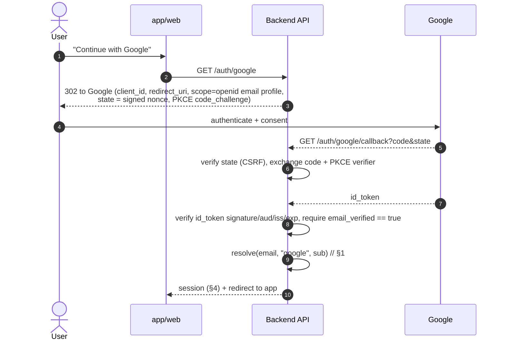
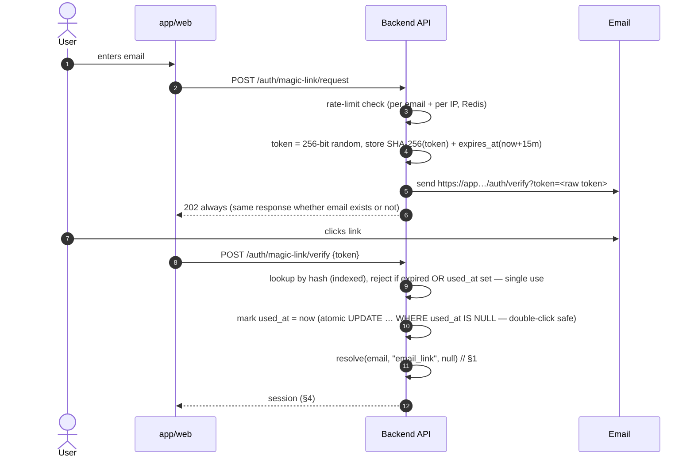

# TravelHub — Auth Flows (Passwordless)

**Status:** Draft v1
**Inputs:** [prd.md](prd.md) §5.1, [erd.md](erd.md) (`User`, `AuthIdentity`, `MagicLinkToken` + their unique constraints), [api_contract.md](api_contract.md) §1.

Two login methods, no passwords anywhere: **Google OAuth** and **email magic link**. Email is the identity key — both methods resolving the same email land in the same account, by design. This doc defines the sequences, the account-resolution logic both share, and the races the ERD's constraints exist to absorb.

---

## 1. Shared core: account resolution

Both flows end at the same function: *"given a verified email (+ optional Google profile), return a session."*

```
resolve(email, provider, provider_user_id?):
  in one DB transaction:
    user = SELECT … FROM users WHERE email = $email FOR UPDATE
    if none: INSERT user (email, email_verified_at = now, full_name from profile or null)
    UPSERT auth_identities (user_id, provider, provider_user_id)
      ON CONFLICT (user_id, provider) DO NOTHING
  issue session (§4)
```

**The double-callback race** (same user, two concurrent first-logins — double-clicked Google button, or Google + magic link racing):

- Both requests find no user → both INSERT → **`User.email` unique** makes the loser fail → loser re-SELECTs and proceeds against the winner's row. No duplicate accounts.
- Both insert identities → **unique (`user_id`, `provider`)** and **unique (`provider`, `provider_user_id`)** make the second a no-op. No duplicate credentials.
- The `provider_user_id` uniqueness is also the account-takeover guard: one Google `sub` can never be attached to two users, so a bug (or attacker) can't graft an existing Google identity onto a different account.

`is_active = false` short-circuits everything after resolution: `403 FORBIDDEN`, no session.

## 2. Google OAuth



Rules: the **backend** does the code exchange (authorization-code + PKCE; no tokens in the browser). `sub` — not email — is stored as `provider_user_id`, because Google emails can change while `sub` is stable. If Google reports `email_verified: false`, reject — otherwise an attacker with an unverified Google account could claim someone's magic-link account.

## 3. Email magic link



Rules, matching the ERD field-for-field:

- **Raw token is never stored** — only `token_hash`. A DB leak yields nothing usable.
- **Single use** enforced by the atomic `used_at IS NULL` update — two tabs clicking the same link produce exactly one session; the second gets the uniform `401 TOKEN_INVALID`.
- Expired / used / unknown tokens return the **same error** (no oracle for which emails exist). The UI response is one screen: "link invalid or expired — request a new one" (PRD §5.1).
- Rate limits (Redis): max 3 requests per email per 15 min, plus a per-IP cap; `requested_ip` stored for abuse review. Still `202` when rate-limited — the email just isn't sent.
- Requesting a new link does not invalidate prior unexpired ones (simpler; 15-minute exposure window is the cap), but a **successful verify invalidates all outstanding tokens for that email**.

## 4. Sessions

- **Access token:** JWT, **15 min**, carries `sub` (user id) + `role`; sent as `Authorization: Bearer`. Stateless verification on every request.
- **Refresh token:** opaque 256-bit random, **30 days**, `httpOnly; Secure; SameSite=Lax` cookie scoped to `/api/v1/auth`; stored server-side **hashed**, one row per device.
- **Rotation:** every `POST /auth/refresh` invalidates the presented token and issues a new one. A refresh attempt with an already-rotated token means theft → revoke the whole chain for that device (reuse detection).
- **Logout:** revokes the refresh token; the access token simply ages out (≤15 min exposure — acceptable; no blocklist in Phase 1).
- Role changes and deactivation take effect within one access-token lifetime; deactivation also revokes refresh tokens immediately.

Session storage is a small `refresh_tokens`-style table (or Redis with TTL) — an implementation detail for M1, kept out of the ERD's commercial model deliberately; decide at implementation and document in the code.

## 5. Phase 2 note (agents)

Travel Agent accounts are created by a Travel Company Admin (no self-registration) but authenticate with these exact same two flows — the invitation email is effectively a magic link. Nothing here needs restructuring for Phase 2; only an invitation-issuance flow gets added.
