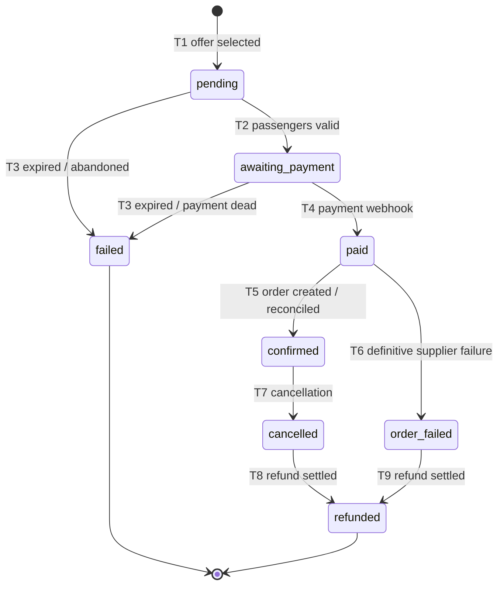

# TravelHub — Booking / Payment / Refund State Machine

**Status:** Draft v1
**Inputs:** [erd.md](erd.md) (Draft v2.1 — status enums, invariants), [prd.md](prd.md) §5.3–5.5 (refund policy, "paid but not booked" requirement), [duffel_api_integration_guide.md](duffel_api_integration_guide.md) §4 (no supplier idempotency, ambiguous-outcome handling).

This doc defines the **only legal transitions** for `Booking.status`, `Payment.status`, and `Refund.status`, who/what may trigger each, the guards that must hold, and the side effects that must fire. Anything not listed here is an illegal transition and must be rejected at the service layer.

**Global rules (apply to every transition):**

1. Every `Booking.status` change writes a `BookingStatusHistory` row (`from_status`, `to_status`, `changed_by_user_id` — null for system/webhook — and `reason`) **in the same DB transaction** as the status update.
2. Status updates take a row lock (`SELECT … FOR UPDATE`) on the booking first. Webhooks, user actions, and the reconciliation worker can race; the lock serializes them.
3. Transitions are **idempotent on replay**: applying the same trigger to a booking already in the target state is a no-op (ack and exit), not an error. This is what makes at-least-once webhook delivery safe.
4. `Payment.status` is a **rollup** — it is derived from `PaymentAttempt` and `Refund` rows, never set independently of them.
5. Payment success is only ever established by a **verified provider webhook** (`payment_intent.succeeded`), never by the client redirect/return URL.

---

## 1. Booking state machine

### States

| State | Meaning | Money state | Supplier state |
|---|---|---|---|
| `pending` | Offer selected; `FlightOfferSnapshot` captured; passenger details being entered | No `Payment` row | Nothing |
| `awaiting_payment` | Checkout reached the pay step; `Payment` row + provider intent created | Authorizing | Nothing |
| `paid` | Money captured; supplier order creation in flight or awaiting reconciliation | Captured | Unknown/creating |
| `confirmed` | Supplier order exists (`supplier_order_id` set); ticketed | Captured | Order + PNR |
| `order_failed` | Money captured but supplier order creation **definitively** failed | Captured → auto-refund | Confirmed absent |
| `failed` | Terminal failure **before** money was captured (offer expired, payment abandoned/declined permanently) | Never captured | Nothing |
| `cancelled` | Post-confirmation cancellation (user or admin); supplier order cancelled | Refund in progress | Cancelled |
| `refunded` | Refund settled (after `cancelled` or `order_failed`) | Returned | Cancelled/absent |

Terminal states: `confirmed` (until a cancellation starts), `failed`, `refunded`.

### Transition table

| # | From → To | Trigger | Actor | Guards | Side effects |
|---|---|---|---|---|---|
| T1 | *(create)* → `pending` | User selects an offer | user | Offer re-fetched from Duffel and not expired | Create `Booking` + `FlightOfferSnapshot` (+ `Slice`/`Segment`); generate `supplier_idempotency_key` now |
| T2 | `pending` → `awaiting_payment` | User submits passenger details and enters checkout | user | All Duffel-required passenger fields present (title, gender, DOB, email, phone, names; ID docs if snapshot requires); offer `expires_at` still in the future | Create `Payment` (`pending`) + provider intent (`PaymentAttempt`) |
| T3 | `pending`/`awaiting_payment` → `failed` | Offer `expires_at` passes without captured payment, or user abandons, or payment fails with no retry | system (expiry sweep) / user | No `PaymentAttempt` in `succeeded` | Reason recorded (`offer_expired` / `abandoned` / `payment_failed`); release any Redis checkout lock |
| T4 | `awaiting_payment` → `paid` | `payment_intent.succeeded` webhook processed | system (webhook) | Event signature verified; attempt matched by `provider_reference_id`; amount == `Booking.total_amount` | `Payment` → `succeeded`; enqueue supplier order creation |
| T5 | `paid` → `confirmed` | Duffel order creation returns 201/200, **or** reconciliation finds the order (`order.created` webhook / list-orders match on metadata key) | system | `supplier_order_id` not already set on another booking (unique constraint backstop) | Persist `supplier_order_id` + `booking_reference`; create `Document` rows from `documents[]`; enqueue itinerary PDF generation + confirmation email |
| T6 | `paid` → `order_failed` | Duffel returns a definitive non-retryable failure (4xx, e.g. offer expired at supplier), **or** reconciliation window closes with verified absence of an order | system | See §4 recovery matrix — never on an ambiguous outcome | Auto-create `Refund` for the full `total_amount` (PRD §5.3); notify user "paid but not booked, refund initiated" |
| T7 | `confirmed` → `cancelled` | User cancellation (auto-approved when snapshot `conditions` permit) or admin cancellation | user / technical_admin | Cancellation quote confirmed by initiator; Duffel cancel call succeeded | Record `supplier_refund_amount`; create `Refund` = supplier refund + full markup (PRD §5.4); notify user |
| T8 | `cancelled` → `refunded` | The booking's refunds settle (`Refund.status = succeeded` covering the committed amount) | system (webhook) | — | `Payment` rollup → `refunded`/`partially_refunded`; notify user |
| T9 | `order_failed` → `refunded` | Same as T8 | system (webhook) | — | Same as T8 |

**Explicitly illegal** (service must reject): `pending` → `paid` (no payment step skipped), any transition out of `failed`/`refunded`, `awaiting_payment` → `confirmed` (order before money), and `confirmed` → `failed`.

---

## 2. Payment state machine (rollup)

| From → To | Rule |
|---|---|
| `pending` → `succeeded` | Any `PaymentAttempt` reaches `succeeded` (via webhook) |
| `pending` → `failed` | All attempts exhausted/abandoned; booking left checkout (T3) |
| `succeeded` → `partially_refunded` | Sum of `succeeded` refunds > 0 and < `Payment.amount` |
| `succeeded` / `partially_refunded` → `refunded` | Sum of `succeeded` refunds == `Payment.amount` |

`PaymentAttempt.status` follows the provider verbatim (`requires_action` → `processing` → `succeeded`/`failed`); a new attempt (retry, 3DS re-entry) is a **new row**, never an update of a failed one. A `failed` payment on a live booking does not fail the booking while the offer is unexpired — the user may retry (new attempt) per PRD §5.3.

## 3. Refund state machine

`pending` → `succeeded` (provider refund webhook) | `pending` → `failed` (provider rejects → alert `technical_admin`, manual follow-up; booking stays in `cancelled`/`order_failed` until resolved). Refund rows are created only by T6, T7, or an explicit admin action — never directly by a user request.

---

## 4. The `paid` recovery matrix (no supplier idempotency)

Duffel accepts no idempotency key, so `paid` is the state where mistakes cost real money. Rules, per the [integration guide](duffel_api_integration_guide.md) §4:

| Create-order outcome | Action |
|---|---|
| 201/200 | T5 → `confirmed` |
| 4xx (validation, offer expired) | T6 → `order_failed` (definitive — Duffel created nothing) |
| 503 | Retry with backoff — Duffel guarantees nothing was created |
| 500 | **Stay `paid`.** No retry; surface to admin with `request_id` |
| Timeout / crash / 202 | **Stay `paid`.** Reconciliation only: match `order.created` webhook, or list orders filtering on our `supplier_idempotency_key` echoed in order `metadata`. Found → T5. Verified absent after the reconciliation window (default: 15 min of repeated checks) → T6 |

A booking may sit in `paid` for minutes. That is correct behavior, not a bug — the UI shows "finalizing your booking," and the reprocessing worker owns getting it out of `paid`. **Never** re-POST an order because `paid` "looks stuck."

---

## 5. Who may trigger what (authorization summary)

| Actor | May trigger |
|---|---|
| `user` (owner) | T1, T2, T7 (own bookings, auto-approvable only), payment retries |
| `technical_admin` | T7 (any booking), manual refunds, resolving stuck `paid`/`order_failed`/refund-`failed` cases |
| system: payment webhook | T4, T8, T9, refund settlement |
| system: supplier webhook / reconciliation worker | T5, T6 |
| system: expiry sweep | T3 |

Next: [sequence_diagrams.md](sequence_diagrams.md) walks the race-prone paths through this machine step by step; [api_contract.md](api_contract.md) maps triggers to endpoints.
