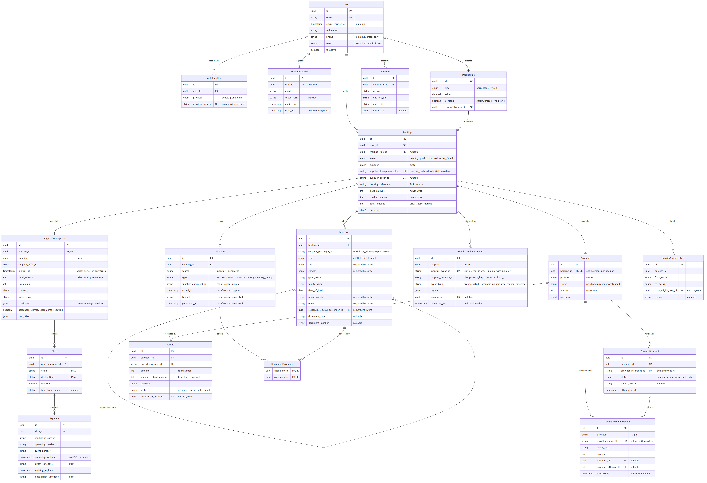
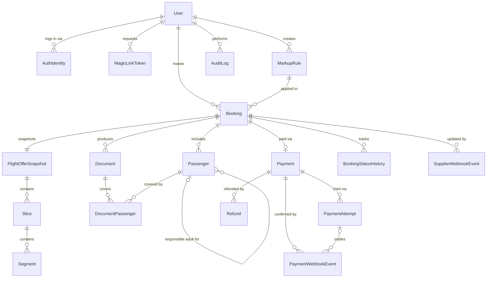

# TravelHub — ERD (Phase 1: Flights Only)

**Status:** Draft v2.1 (v2: design review — supplier-side gaps closed, money model tightened; v2.1: corrections from fact-checking Duffel's docs — no supplier idempotency support, real webhook event names/dedup key, exact `documents[].type` values, offer expiry is variable)
**Scope:** Direct B2C users booking flights via Duffel, paid through Stripe (test mode). No hotels, no Travel Company/Agent layer, no wallet yet — those are Phase 2+ per [prd.md](prd.md).

Design decisions driving this schema, all deliberate:

1. **We own a full snapshot of what was booked**, not just a Duffel order ID. Duffel is the airline-side source of truth for the PNR, but our DB is the source of truth for *what the customer was shown and charged* — needed for support, disputes, and audit independent of Duffel's live data changing later. The snapshot therefore includes the offer's **price, cabin class, and fare conditions**, plus the raw offer payload.
2. **Payment is provider-agnostic even though only Stripe is wired up now.** A `provider` field plus a separate `PaymentAttempt`/`PaymentWebhookEvent`/`Refund` layer means adding Paymob or Moyasar later is additive, not a schema rewrite — and it's what actually lets you build real retry/webhook/idempotency logic instead of a single happy-path charge call.
3. **Flight supply is supplier-agnostic too — symmetrically.** The supplier side gets the same treatment as the payment side: a `supplier` enum, an order-creation **idempotency key** we control (client-side only — Duffel accepts none; see `Booking`), and a `SupplierWebhookEvent` table for Duffel's at-least-once order webhooks (schedule changes, airline cancellations). Post-purchase, the supplier is *not* write-only.
4. **Auth is passwordless: Google OAuth + email magic link.** No `password_hash` on `User` — instead an `AuthIdentity` table (provider-agnostic, same pattern as payment/supplier) and a `MagicLinkToken` table for the email flow. Identity rows *are* the credentials, so they carry hard unique constraints.
5. **Contact info lives on the booking flow, not the account.** Duffel requires `phone_number` and `email` **per passenger** to create an order — and also `title` and `gender`, which are just as mandatory. `User.phone` stays optional (used only to prefill the checkout form); the real required fields live on `Passenger`.
6. **Duffel has its own passenger ID namespace.** Order passengers, `documents[].passenger_ids`, and webhook payloads all reference Duffel's IDs, not ours — so `Passenger.supplier_passenger_id` is the mapping that makes every supplier response resolvable to our rows.
7. **Duffel doesn't send a PDF.** Its `documents[]` array gives you a ticket number, a type, and which passengers it covers — nothing downloadable. Generating the itinerary/receipt PDF is our job. `Document` distinguishes supplier-issued ticket records from files we generate (`source` discriminator), and links to passengers via a proper join table.
8. **Money is stored as integer minor units** (cents, fils, …) with an ISO 4217 currency code. This survives 0-decimal (JPY) and 3-decimal (KWD, BHD) currencies that Duffel will actually return. **Phase 1 constraint: a booking, its payment, and its refunds share one currency** — cross-currency (an `fx_rate` + `quoted_at` pair) is deferred until Paymob/Moyasar make it real, and is additive when it comes.
9. **Flight times are local wall-clock times, never normalized to UTC.** Duffel returns local times; "departs 09:15" must render as 09:15 regardless of the viewer's timezone. Segments store the local datetime plus the IANA timezone per endpoint.

---

## Entities

### User
No password — see `AuthIdentity`/`MagicLinkToken` below.
| Field | Type | Notes |
|---|---|---|
| id | PK | |
| email | string, unique | Identity key — Google and magic-link auth both resolve to this |
| email_verified_at | timestamp, nullable | Set on first successful Google login or magic-link verification |
| full_name | string | From Google profile, or collected post-signup for email-link users |
| phone | string, nullable | Convenience prefill only — never the source of truth for a booking's contact info |
| role | enum(`technical_admin`, `user`) | Phase 2 adds `travel_company_admin`, `travel_agent` — not modeled yet |
| is_active | boolean | |
| created_at / updated_at | timestamp | |

### AuthIdentity
One row per login method a user has used. Same "provider enum + adapter" pattern as `Payment`. Because these rows are the credentials in a passwordless system, uniqueness is enforced hard:
- **unique (`provider`, `provider_user_id`)** where `provider_user_id` is not null — one Google `sub` can never map to two users (account-takeover guard, and absorbs double-submitted OAuth callbacks).
- **unique (`user_id`, `provider`)** — one identity row per method per user.

| Field | Type | Notes |
|---|---|---|
| id | PK | |
| user_id | FK → User | |
| provider | enum(`google`, `email_link`) | Extensible — Apple/Facebook later without a schema change |
| provider_user_id | string, nullable | Google's `sub` claim; null for `email_link` |
| created_at | timestamp | |

### MagicLinkToken
| Field | Type | Notes |
|---|---|---|
| id | PK | |
| user_id | FK → User, nullable | Null until the email is confirmed to belong to an existing/new user |
| email | string | What the link was requested for |
| token_hash | string, **indexed** | Store a hash, never the raw token — compare hashes on verification; this is the verification hot path |
| expires_at | timestamp | Short-lived (~15 min) |
| used_at | timestamp, nullable | Single-use — reject if already set |
| requested_ip | string, nullable | Basic abuse/rate-limit signal |
| created_at | timestamp | |

### MarkupRule
Satisfies the PRD requirement that markup be admin-configurable, not hardcoded.

**Semantics (the number revenue depends on):** `percentage` applies to `Booking.base_amount` (Duffel's charge to us, taxes included), computed **once per booking** (not per passenger), rounded **half-up to the minor unit**. `fixed` is a minor-unit amount in the booking currency.

**Constraint:** partial unique index on `is_active` where true — "only one active rule" is enforced by the database, not by convention, so two admins toggling simultaneously can't leave two rules active.

| Field | Type | Notes |
|---|---|---|
| id | PK | |
| type | enum(`percentage`, `fixed`) | |
| value | decimal | Percentage (e.g. `2.500`) or minor-unit amount for `fixed` |
| is_active | boolean | Partial unique index: at most one row where true |
| created_by_user_id | FK → User | Must be a `technical_admin` |
| created_at / updated_at | timestamp | |

### Booking
The commercial record — one per flight purchase.

**Invariants:**
- CHECK `total_amount = base_amount + markup_amount` (single shared `currency` makes this well-defined).
- `supplier_idempotency_key` is generated **before** the first supplier order-creation call and reused on every retry. **Fact-check note: Duffel's Create Order accepts no client idempotency key** — this key is purely our own dedup mechanism, so it must also be **echoed into the Duffel order's `metadata`**: after a crash/timeout the recovery path is the `order.created` webhook or listing recent orders and matching on this key. Never blind-retry an ambiguous (200/202/timeout) outcome — that is exactly how duplicate airline orders happen.
- `supplier_order_id` unique (nullable) — the database refuses a second booking claiming the same Duffel order.

| Field | Type | Notes |
|---|---|---|
| id | PK | |
| user_id | FK → User | Indexed with `created_at` for the my-bookings list |
| markup_rule_id | FK → MarkupRule, nullable | Which rule was applied at booking time |
| status | enum(`pending`, `awaiting_payment`, `paid`, `confirmed`, `order_failed`, `cancelled`, `failed`, `refunded`) | `paid` = money captured, supplier order in flight; `order_failed` = money captured but supplier order creation definitively failed (refund path) — a real state, not a `failed` catch-all. State machine doc next. |
| supplier | enum(`duffel`) | One value today; exists so a second supplier is additive, not a migration |
| supplier_idempotency_key | string, **unique** | Ours only — Duffel offers no idempotency support; echoed into Duffel order `metadata` for post-timeout reconciliation |
| supplier_order_id | string, nullable, **unique** | Set once the supplier's order creation succeeds |
| booking_reference | string, nullable, indexed | Airline PNR, from the supplier's order — support looks bookings up by this |
| base_amount | integer (minor units) | What Duffel charges us |
| markup_amount | integer (minor units) | Computed from MarkupRule at booking time |
| total_amount | integer (minor units) | What the customer pays; CHECK = base + markup |
| currency | char(3), ISO 4217 | One currency per booking in Phase 1 (see design decision 8) |
| created_at / updated_at | timestamp | |

### FlightOfferSnapshot (1:1 with Booking)
Frozen copy of the supplier's offer at the moment of booking — including everything the customer was shown and everything a later cancellation needs.
| Field | Type | Notes |
|---|---|---|
| id | PK | |
| booking_id | FK → Booking, unique | |
| supplier | enum(`duffel`) | Matches `Booking.supplier` |
| supplier_offer_id | string | |
| expires_at | timestamp | Supplier's own offer expiry — **no fixed window**; varies per offer/airline (LCCs can be minutes), this field is the only truth |
| owner_airline_name / owner_airline_iata | string | |
| total_amount / tax_amount | integer (minor units) | The offer's own price breakdown, pre-markup — what Duffel quoted |
| currency | char(3) | |
| cabin_class | string | e.g. `economy` — part of "what the customer was shown" |
| conditions | JSON | Duffel's `conditions` (`refund_before_departure`, `change_before_departure` + penalties) — the data a cancellation/change flow prices from |
| passenger_identity_documents_required | boolean | Drives whether checkout must collect passport/ID fields — comes straight off the Duffel offer |
| raw_offer | JSON | The full offer payload as returned. Cheap, and the whole point of a snapshot is fidelity — disputes get the exact bytes |
| captured_at | timestamp | |

### Slice (offer snapshot → slices)
| Field | Type | Notes |
|---|---|---|
| id | PK | |
| offer_snapshot_id | FK → FlightOfferSnapshot | |
| origin / destination | string (IATA) | |
| duration | string/interval | |
| fare_brand_name | string, nullable | |

### Segment (slice → segments)
Times are **local wall-clock, stored without UTC conversion** (`timestamp without time zone`), each paired with its IANA timezone (Duffel provides it per airport). Sorting/alerting derives UTC at read time; display never converts.
| Field | Type | Notes |
|---|---|---|
| id | PK | |
| slice_id | FK → Slice | |
| marketing_carrier / operating_carrier | string | Codeshare distinction |
| flight_number | string | |
| aircraft | string, nullable | |
| departing_at_local | timestamp (no tz) | Local time at origin — never normalized to UTC |
| origin_timezone | string (IANA) | e.g. `Africa/Cairo` |
| arriving_at_local | timestamp (no tz) | Local time at destination |
| destination_timezone | string (IANA) | |
| origin_terminal / destination_terminal | string, nullable | |

### Passenger
Everything Duffel hard-requires to create an order lives here: `given_name`, `family_name`, `title`, `gender`, `date_of_birth`, `phone_number`, `email`.

**Constraints:**
- unique (`booking_id`, `supplier_passenger_id`) where not null.
- `responsible_adult_passenger_id` required when `type = infant` (Duffel requires infants be associated with an adult on the same order).

| Field | Type | Notes |
|---|---|---|
| id | PK | |
| booking_id | FK → Booking | |
| supplier_passenger_id | string, nullable | **Duffel's passenger ID** (assigned at offer-request time, echoed in orders, `documents[].passenger_ids`, and webhooks). Null until known; the mapping that makes every supplier response resolvable to our rows |
| type | enum(`adult`, `child`, `infant`) | |
| title | enum(`mr`, `ms`, `mrs`, `miss`) | **Required by Duffel** to create an order |
| gender | enum(`m`, `f`) | **Required by Duffel** to create an order |
| given_name / family_name | string | |
| date_of_birth | date | |
| phone_number | string | **Required by Duffel per passenger to create an order** — not optional |
| email | string | **Required by Duffel per passenger** — defaults to the account email for the primary passenger, editable for others |
| responsible_adult_passenger_id | FK → Passenger, nullable | Required when `type = infant` |
| document_type | string, nullable | passport/national_id etc. — required only when `FlightOfferSnapshot.passenger_identity_documents_required` is true |
| document_number | string, nullable | |
| document_expiry | date, nullable | |
| nationality | string, nullable | |

### Payment (0..1 per Booking)
Current state of money for a booking. Provider-agnostic by design. A booking in `pending` (offer selected, passengers being entered) has **no payment row yet** — the row is created when checkout reaches the pay step. `Payment.amount` must equal `Booking.total_amount` at creation (application-enforced invariant).
| Field | Type | Notes |
|---|---|---|
| id | PK | |
| booking_id | FK → Booking, unique | The unique FK is what makes two payments for one booking impossible |
| provider | enum(`stripe`) | Single value today; enum grows later, not the schema shape |
| status | enum(`pending`, `succeeded`, `failed`, `refunded`, `partially_refunded`) | Refund *details* live in `Refund` — this is just the rollup |
| amount | integer (minor units) | = `Booking.total_amount` at creation |
| currency | char(3) | = `Booking.currency` in Phase 1 |
| created_at / updated_at | timestamp | |

### PaymentAttempt (Payment → attempts)
This is where the actual gateway integration logic lives — retries, failures, 3DS, etc. `provider_reference_id` is **unique** — it's the key webhooks match on, and one Stripe PaymentIntent can never belong to two attempts.
| Field | Type | Notes |
|---|---|---|
| id | PK | |
| payment_id | FK → Payment | |
| provider_reference_id | string, **unique, indexed** | Stripe PaymentIntent id — the webhook-matching key |
| status | enum(`requires_action`, `processing`, `succeeded`, `failed`) | |
| failure_reason | string, nullable | |
| method | string, nullable | card / wallet / etc. |
| attempted_at | timestamp | |

### PaymentWebhookEvent
Inbound events from the gateway — dedupe + audit trail, not trust-the-client. Dedupe is **unique (`provider`, `provider_event_id`)** — composite, because two providers' event ID namespaces can collide once Paymob/Moyasar arrive.
| Field | Type | Notes |
|---|---|---|
| id | PK | |
| provider | enum(`stripe`) | |
| provider_event_id | string | Unique together with `provider` |
| event_type | string | e.g. `payment_intent.succeeded` |
| payload | JSON | Raw event body |
| payment_id | FK → Payment, nullable | Resolved after matching |
| payment_attempt_id | FK → PaymentAttempt, nullable | Which *attempt* the event settles — with 3DS retries, payment-level isn't enough |
| received_at / processed_at | timestamp | `processed_at` null until handled; partial index on `processed_at IS NULL` for the reprocessing worker |

### Refund
`refunded` / `partially_refunded` are rollup statuses; this is the record behind them — amount, provider reference, who, when, why. "Partially refunded" is meaningless without an amount.
| Field | Type | Notes |
|---|---|---|
| id | PK | |
| payment_id | FK → Payment | |
| provider_refund_id | string, **unique** | Stripe refund id |
| amount | integer (minor units) | What we return to the customer |
| currency | char(3) | = booking currency in Phase 1 |
| supplier_refund_amount | integer (minor units), nullable | What Duffel refunded **us** on cancellation — airline-determined, often less than the customer paid. This is what makes markup accounting reconcilable |
| status | enum(`pending`, `succeeded`, `failed`) | |
| reason | string, nullable | |
| initiated_by_user_id | FK → User, nullable | null = system-triggered |
| created_at / updated_at | timestamp | |

### SupplierWebhookEvent
The supplier-side twin of `PaymentWebhookEvent` — Duffel delivers order lifecycle events **at-least-once**, unordered, retried up to 72h. Verified event types: `order.created`, `order.airline_initiated_change_detected`, `ping.triggered` (there is **no** documented `order.updated`). Phase 1 doesn't have to *act* on a schedule change, but it must be able to receive, dedupe, and store one — otherwise the customer's stored segments silently go stale.

**Dedup caution (verified):** Duffel events carry a unique event `id` (`wev_…`) *and* an `idempotency_key` — but the `idempotency_key` is the **related resource's ID** (e.g. `ord_…`), not a per-event key. Dedupe on the event `id`; use `idempotency_key` only to resolve the booking. Deduping on `idempotency_key` would silently drop distinct events about the same order.
| Field | Type | Notes |
|---|---|---|
| id | PK | |
| supplier | enum(`duffel`) | |
| supplier_event_id | string | **Duffel's event `id` (`wev_…`)** — unique together with `supplier` |
| supplier_resource_id | string, nullable | Duffel's `idempotency_key` = related resource id (`ord_…`) — the booking-matching key, indexed |
| event_type | string | e.g. `order.created`, `order.airline_initiated_change_detected` |
| payload | JSON | Raw event body |
| booking_id | FK → Booking, nullable | Resolved after matching `order_id` → `Booking.supplier_order_id` |
| received_at / processed_at | timestamp | Same reprocessing pattern as the payment side |

### Document
The ticket/itinerary artifact. Two genuinely different things live here, distinguished by `source`:
- **`supplier`** — Duffel's ticket record: `supplier_document_id` (the real e-ticket number, verified airline-side against the PNR) + `issued_at`. Required for this source.
- **`generated`** — our itinerary/receipt PDF, built from order data, stored in blob storage: `file_url` + `generated_at`. Required for this source. A booking-level receipt covers all passengers and is backed by no single Duffel document — so it can't carry an honest `issued_at`.

| Field | Type | Notes |
|---|---|---|
| id | PK | |
| booking_id | FK → Booking | |
| source | enum(`supplier`, `generated`) | Discriminator — see above |
| type | enum(`electronic_ticket`, `electronic_miscellaneous_document_associated`, `electronic_miscellaneous_document_standalone`, `itinerary_receipt`) | First three are Duffel's verified `documents[].type` values (there is no plain `electronic_miscellaneous_document`); last is ours |
| supplier_document_id | string, nullable | Duffel's `unique_identifier`. Required when `source = supplier` |
| issued_at | timestamp, nullable | When the supplier confirmed issuance. Required when `source = supplier` |
| file_url | string, nullable | Blob-storage URL. Required when `source = generated` |
| generated_at | timestamp, nullable | Required when `source = generated` |

### DocumentPassenger (join: Document ↔ Passenger)
A document can cover multiple passengers (Duffel's `documents[].passenger_ids`) — modeled as a real join table, not a JSON array of IDs, so the FKs actually enforce integrity and the relation is queryable. Duffel's passenger IDs resolve to rows via `Passenger.supplier_passenger_id`.
| Field | Type | Notes |
|---|---|---|
| document_id | FK → Document | Composite PK with `passenger_id` |
| passenger_id | FK → Passenger | |

### BookingStatusHistory
Audit trail for the booking state machine.
| Field | Type | Notes |
|---|---|---|
| id | PK | |
| booking_id | FK → Booking | |
| from_status / to_status | enum | |
| changed_by_user_id | FK → User, nullable | null = system-triggered (e.g. webhook) |
| reason | string, nullable | |
| created_at | timestamp | |

### AuditLog
Generic admin-action trail — satisfies the NFR that admin actions be auditable.
| Field | Type | Notes |
|---|---|---|
| id | PK | |
| actor_user_id | FK → User | |
| action | string | e.g. `markup_rule.updated` |
| entity_type / entity_id | string / string | Polymorphic reference |
| metadata | JSON, nullable | Before/after values |
| created_at | timestamp | |

---

## Constraints & Indexes (consolidated)

Uniqueness that prevents corruption:
- `User.email` unique
- `AuthIdentity` — unique (`provider`, `provider_user_id`) where not null; unique (`user_id`, `provider`)
- `Booking.supplier_idempotency_key` unique; `Booking.supplier_order_id` unique (nullable)
- `Payment.booking_id` unique (one payment per booking, by the database)
- `PaymentAttempt.provider_reference_id` unique
- `PaymentWebhookEvent` unique (`provider`, `provider_event_id`); `SupplierWebhookEvent` unique (`supplier`, `supplier_event_id`)
- `Refund.provider_refund_id` unique
- `Passenger` unique (`booking_id`, `supplier_passenger_id`) where not null
- `MarkupRule` partial unique on `is_active` where true
- `FlightOfferSnapshot.booking_id` unique
- `DocumentPassenger` composite PK (`document_id`, `passenger_id`)

CHECKs:
- `Booking`: `total_amount = base_amount + markup_amount`
- `Passenger`: `type != 'infant' OR responsible_adult_passenger_id IS NOT NULL`
- `Document`: source-conditional requiredness (supplier → `supplier_document_id` + `issued_at`; generated → `file_url` + `generated_at`)

Access-pattern indexes:
- `Booking (user_id, created_at DESC)` — my-bookings list
- `Booking (booking_reference)` — support lookup by PNR
- `MagicLinkToken (token_hash)` — verification hot path
- `PaymentWebhookEvent (processed_at) WHERE processed_at IS NULL` — reprocessing worker (same on `SupplierWebhookEvent`)

---

## Relationships

Full diagram with fields: [erd.png](erd.png)

Cardinality notes:
- `Booking → Payment` is **0..1**, not 1:1 — a `pending` booking has no payment row yet.
- `PaymentWebhookEvent.payment_id` / `payment_attempt_id` / `SupplierWebhookEvent.booking_id` are nullable: unmatched events are stored first, resolved after.

---

## Deliberately Excluded (Phase 2+)

- `TravelCompany`, `TravelAgent`, `Wallet`, `WalletTransaction`, `CommissionRule` — B2B layer, per PRD Phase 2.
- `Accommodation`/`Room`/`Rate`/hotel-side entities — flights-only for now.
- Cross-currency money (`fx_rate`, `quoted_at`) — deferred until Paymob/Moyasar make it real; additive to the minor-units model.
- Provider-specific tables for Paymob/Moyasar or a second flight supplier — the `provider`/`supplier` enums plus the adapter-shaped tables (`PaymentAttempt`/`PaymentWebhookEvent`/`Refund`, `FlightOfferSnapshot`/`SupplierWebhookEvent`) already accommodate them without migration surgery when they're added.
- Apple/Facebook/other OAuth providers — `AuthIdentity.provider` accommodates them the same way.

---

## Next

This feeds the **[Booking/Payment state machine](booking_state_machine.md)** (transition rules for the `status` enums above, including the `paid` → `confirmed` / `order_failed` fork the idempotency key exists for), the **[sequence diagrams](sequence_diagrams.md)** (race-prone flows), and the **[API contract](api_contract.md)** (each entity here maps to request/response shapes). See also [auth_flow.md](auth_flow.md) and [nfr.md](nfr.md).
