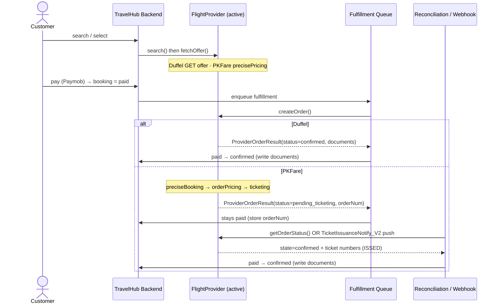
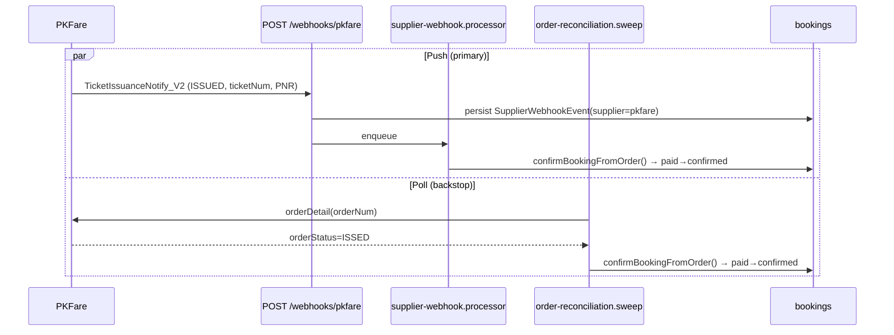

# PKFare Integration — System Architecture

The concrete design an implementer follows to add PKFare without breaking Duffel. This is the
**spec**: module layout, exact TypeScript interfaces/DTOs, sequence diagrams, error taxonomy, and
the booking-state-machine mapping. Pair it with [api-contracts.md](./api-contracts.md) (wire
formats) and [integration-guide.md](./integration-guide.md) (phased task list).

Design pattern: **Ports & Adapters (hexagonal)** with a **single global selector**. One provider
is active at a time, chosen by the `FLIGHT_PROVIDER` env var (`duffel` default). Nothing outside
`src/duffel`, `src/pkfare`, and `src/flights/provider` knows which supplier is live.

---

## 1. Target module structure

```
app/Backend/src/
├── flights/
│   ├── provider/
│   │   ├── flight-provider.interface.ts   # ⭐ the PORT + shared DTOs (promoted here)
│   │   └── flight-provider.module.ts       # ⭐ selector: binds FLIGHT_PROVIDER token by env
│   ├── flights.service.ts                  # injects FLIGHT_PROVIDER (was DuffelService)
│   └── flights.controller.ts
├── duffel/
│   ├── duffel.service.ts                   # implements FlightProvider (unchanged behavior)
│   └── duffel.module.ts
├── pkfare/                                 # ⭐ NEW adapter (dormant until selected)
│   ├── pkfare.module.ts
│   ├── pkfare.service.ts                   # implements FlightProvider
│   ├── pkfare-signature.util.ts            # sign = md5(partnerId+partnerKey), fetch wrapper
│   ├── pkfare-offer.mapper.ts              # shopping/pricing JSON → NormalizedOffer
│   ├── pkfare-order.mapper.ts              # booking/orderDetail JSON → ProviderOrderResult/Status
│   └── pkfare.service.spec.ts              # fixture-based unit tests
└── bookings/
    ├── services/
    │   ├── order-fulfillment.service.ts    # injects FLIGHT_PROVIDER; handles pending_ticketing
    │   └── order-reconciliation.service.ts # (renamed from duffel-reconciliation) provider-agnostic
    ├── queues/
    │   └── supplier-webhook.processor.ts   # generalized; handles duffel + pkfare events
    └── supplier-webhooks.controller.ts     # POST /webhooks/duffel and /webhooks/pkfare
```

**Data model:** already supplier-agnostic. Only change is adding `Pkfare = 'pkfare'` to the
`Supplier` enum + an additive `ALTER TYPE supplier_provider ADD VALUE 'pkfare'` migration. No new
tables — `supplier_webhook_events`, `bookings.supplier`, `flight_offer_snapshots.supplier`,
generic `supplier_*` columns all already exist.

---

## 2. The port — `flight-provider.interface.ts`

Promote the DTOs currently declared inside `duffel/duffel.service.ts` (`NormalizedOffer`,
`NormalizedSlice`, `NormalizedSegment`, `NormalizedConditions`, `MinorUnitMoney`,
`CreateOrderParams`, `CreateOrderPassenger`) into this file so neither adapter owns the canonical
shape. Duffel then imports them from here.

```ts
import { Supplier, Booking } from '../../bookings/entities/booking.entity';

export const FLIGHT_PROVIDER = Symbol('FLIGHT_PROVIDER');

/** Result of createOrder — the discriminator absorbs the sync(Duffel)/async(PKFare) split. */
export interface ProviderOrderResult {
  status: 'confirmed' | 'pending_ticketing';
  orderId: string;                 // Duffel ord_… / PKFare orderNum
  bookingReference: string | null; // PNR (may be null until ticketed for PKFare)
  documents: ProviderDocument[];   // e-tickets (empty until ISSED for PKFare)
}

export interface ProviderDocument {
  type: string;                    // 'electronic_ticket' | ...
  uniqueIdentifier: string;        // ticket number
  passengerIds: string[];
}

/** Reconciliation query result — how the sweep advances paid → confirmed / order_failed. */
export interface ProviderOrderStatus {
  state: 'confirmed' | 'pending' | 'failed' | 'absent';
  orderId: string | null;
  bookingReference: string | null;
  documents: ProviderDocument[];
  raw: Record<string, unknown>;    // provider payload for confirmBookingFromOrder
}

export interface ProviderMetrics {
  configured: boolean;
  requestsLastHour: number;
  errorsLastHour: number;
  recentErrorRate: number;
  walletBalanceLow?: boolean;      // PKFare prepaid-wallet health (Duffel: undefined)
}

export interface FlightProvider {
  readonly supplier: Supplier;
  isConfigured(): boolean;
  assertConfigured(): void;

  search(params: FlightSearchParams): Promise<NormalizedOffer[]>;
  fetchOffer(offerId: string): Promise<NormalizedOffer>;          // Duffel GET / PKFare precisePricing
  searchAirports(query: string): Promise<AirportSuggestion[]>;

  createOrder(params: CreateOrderParams): Promise<ProviderOrderResult>;
  getOrderStatus(booking: Booking): Promise<ProviderOrderStatus>; // reconciliation port
  cancelOrder(orderRef: string): Promise<{ refundAmount: number }>;

  getMetrics(): Promise<ProviderMetrics>;

  supportsWebhooks(): boolean;
  verifyWebhookSignature?(rawBody: Buffer | string, sig?: string): boolean;
}
```

Provider-neutral errors (rename Duffel's, re-export old names for a clean move):

```ts
export class ProviderDefinitiveError extends Error {          // order NOT created; safe to refund
  constructor(public readonly statusCode: number, message: string) { super(message); }
}
export class ProviderAmbiguousError extends Error {           // outcome unknown; DO NOT retry
  constructor(message: string, public readonly requestId?: string) { super(message); }
}
```

### Selector — `flight-provider.module.ts`

```ts
@Module({
  imports: [DuffelModule, PkfareModule],
  providers: [{
    provide: FLIGHT_PROVIDER,
    inject: [ConfigService, DuffelService, PkfareService],
    useFactory: (cfg: ConfigService, duffel: DuffelService, pkfare: PkfareService) =>
      cfg.get<string>('FLIGHT_PROVIDER') === 'pkfare' ? pkfare : duffel,
  }],
  exports: [FLIGHT_PROVIDER],
})
export class FlightProviderModule {}
```

Every consumer injects `@Inject(FLIGHT_PROVIDER) private readonly provider: FlightProvider` and
imports `FlightProviderModule`. The 7 current `DuffelService` injection sites are listed in
[duffel-coupling-and-gaps.md](./duffel-coupling-and-gaps.md#part-1--current-duffel-coupling-points).

---

## 3. Booking flow — Duffel vs PKFare (sequence)



**Key architectural move:** the `pending_ticketing` branch reuses the reconciliation sweep +
webhook machinery already built for Duffel's ambiguous outcomes. `OrderFulfillmentService` gets a
small change: on `status === 'pending_ticketing'`, leave the booking in `paid` (store `orderId`)
instead of transitioning to `confirmed`.

---

## 4. Confirmation paths for PKFare (push + poll)



Both paths funnel through the **existing** shared
`OrderReconciliationService.confirmBookingFromOrder(manager, booking, raw)` — which is
replay-safe (the state machine no-ops if already `confirmed`). The webhook controller 404s for the
inactive provider so a stray delivery post-cutover can't mutate state.

---

## 5. Order-status → booking-state mapping

| PKFare `orderStatus` | `ProviderOrderStatus.state` | Booking transition | Notes |
|---|---|---|---|
| `TO_BE_PAID`, `ISS_PRC`, `TO_BE_RSV` | `pending` | stay `paid` | keep polling |
| `ISSED` | `confirmed` | `paid → confirmed` (T5) | write `ticketNum` documents + `pnr`/`airPnr` |
| `RSV_FAIL` | `failed` | `paid → order_failed` (T6) + auto-refund | reservation failed |
| `CNCL`, `CNCL_TO_BE_REIM`, `CNCL_REIMED` | `failed` | `paid → order_failed` (T6) + refund | ticketing failed / cancelled |
| `UNDER_REVIEW`, `HOLD` | `pending` | stay `paid` (flag for admin) | manual review |
| `REFD_*` | (refund flow) | refund pipeline | settle supplier ledger on `REFD_REIMED` |
| `CHG_*` | (change flow) | schedule-change handling | follow-up, not go-live critical |

Duffel maps its own outcomes onto the same three sweep results (`confirmed`/`pending`/`failed`) —
`getOrderStatus()` hides the difference.

---

## 6. Error taxonomy (drives the recovery matrix)

`createOrder()` in each adapter must classify provider errors into the two neutral error types so
`OrderFulfillmentService` (unchanged) applies the paid-recovery matrix
(`booking_state_machine.md §4`):

| Class | Duffel | PKFare (from [api-contracts.md](./api-contracts.md)) | Adapter throws | Fulfillment action |
|---|---|---|---|---|
| Definitive (order NOT created) | 4xx | `P0xx`, `B004/B022/B062/B064/B065/B077-B080` (validation), `0307` sold out, ticketing `B022` wallet | `ProviderDefinitiveError` | `paid → order_failed` + refund (T6) |
| Ambiguous (order MAY exist) | 500 / 503 / timeout | **`B006` (OrderNum in msg)**, `B012`/`B028` PNR timeout, `B024` timeout, network | `ProviderAmbiguousError` | **stay `paid`**; reconcile via `orderDetail` (never blind-retry) |
| Price changed | offer expired/price mismatch | `B017` (booking), `B116`/`B113` (orderPricing) | `ProviderDefinitiveError` (or bespoke) | abort + refund, or re-quote |
| Duplicate | — | `B029`, refund `B153` | treat as existing order | reconcile, do not create again |

`B006` is the dangerous one: the booking **failed but an order exists** — the adapter must parse
the `OrderNum` out of the message, store it, and let reconciliation resolve it.

---

## 7. Adapter internals — PKFare specifics

- **Signing** (`pkfare-signature.util.ts`): `sign = md5(partnerId + partnerKey)` computed once and
  cached; every request wraps `{ authentication: { partnerId, sign }, <payload> }`. `fetch` wrapper
  POSTs to `${PKFARE_API_BASE}/json/<name>`, parses `errorCode` (`"0"`=ok), applies timeouts (30 s
  search/pricing, 130 s booking/ticketing), and translates `errorCode` classes into the neutral
  errors above.
- **Amounts:** PKFare fares are **decimals per pax type**; the mapper sums
  `adtFare+adtTax` (×adults) + `chdFare+chdTax` (×children) + `infFare+infTax` (×infants) and
  converts to minor units for `NormalizedOffer.total` (reuse the same currency-decimals table as
  `duffel.service.ts`).
- **`expires_at`:** PKFare has none — synthesize a conservative TTL (60–120 s) so cache/countdown
  code is unchanged; real freshness comes from the mandatory `precisePricing`/`orderPricing`
  re-checks. (See [gap 2](./duffel-coupling-and-gaps.md#gap-2--no-offer-expires_at).)
- **`createOrder()` orchestration:** `preciseBooking_V7` → store `orderNum` → `orderPricingV5`
  (abort on `B116` price change) → `ticketing` (abort on `B022` wallet) → return
  `{ status: 'pending_ticketing', orderId: orderNum, bookingReference: pnr }`.
- **`getOrderStatus()`:** `orderDetail/v13` → map `orderStatus` per §5; on `ISSED` build
  `documents` from `passengers[].ticketNum`.
- **`cancelOrder()`:** `cancel` if still `TO_BE_PAID`; else the Refund API flow
  ([api-contracts §9](./api-contracts.md#9-refund-apis-async-post-ticketing)).
- **`searchAirports()`:** local IATA list (no PKFare suggestions endpoint).
- **`getMetrics()`:** Redis sliding window keyed `pkfare:metrics:*` + `walletBalanceLow`.

---

## 8. Configuration

```bash
# Flight provider selection
FLIGHT_PROVIDER=duffel                     # duffel | pkfare
PKFARE_API_BASE=https://api.pkfare.com
PKFARE_PARTNER_ID=
PKFARE_PARTNER_KEY=
# Existing Duffel vars stay (existing bookings resolve via booking.supplier)
DUFFEL_API_KEY=
DUFFEL_WEBHOOK_SECRET=
```

Register the `TicketIssuanceNotify_V2` push URL
(`https://api.safariyat.live/api/v1/webhooks/pkfare`) with the PKFare account manager.

---

## 9. What stays untouched (safety guarantees)

- **Booking state machine** (`BookingStateMachineService`) — unchanged; PKFare reuses T5/T6.
- **Payment** (Paymob) — unchanged; the customer charge is independent of the supplier.
- **Ledger** (double-entry) — unchanged; PKFare adds only a "pending supplier reimbursement"
  settled on `REFD_REIMED`.
- **Refund pipeline** (`refund_execution_queue`) — unchanged; customer is paid per policy
  immediately.
- **Existing Duffel bookings** — resolve via stored `booking.supplier`, not the global flag, so
  cutover cannot affect them.

The entire PKFare surface lives inside `src/pkfare/`, the generalized reconciliation sweep, and
the supplier-scoped webhook controller. Everything else only sees `FlightProvider`.
