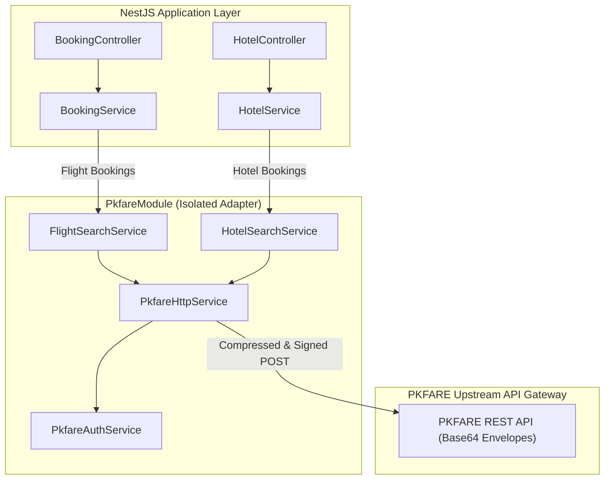
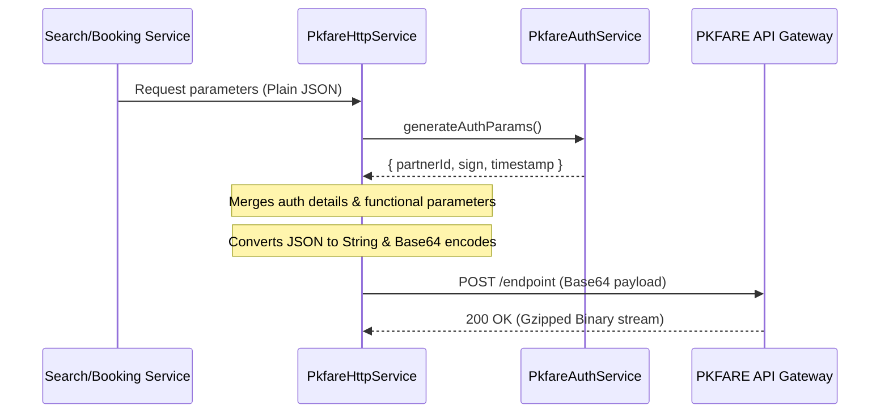
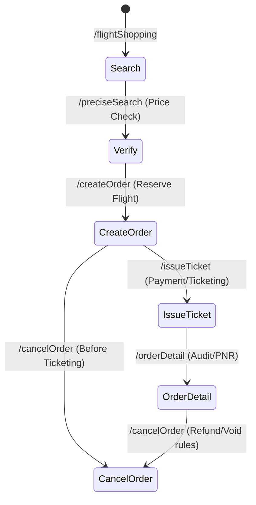
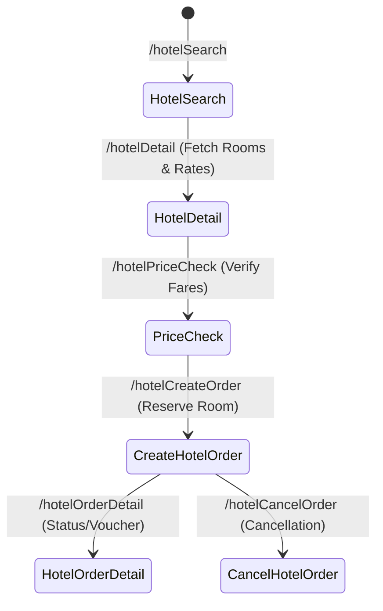

# ✈️ TravelHub: PKFARE API Integration Guide

Welcome to the definitive integration and developer guide for connecting the **TravelHub B2B Platform** with the **PKFARE API**. This document outlines the authentication mechanics, request/response transport protocols, functional workflows for flight and hotel bookings, NestJS code architecture, and a pre-meeting checklist for aligning with the PKFARE technical team (specifically Mr. Richil).

---

## 🏛️ 1. Integration Architecture Overview

PKFARE is the core upstream global distribution system (GDS) and aggregator for our platform. It supplies rich, real-time availability and ticketing engines for both **Flights** and **Hotels**. 

To isolate upstream API complexities, the TravelHub backend utilizes a dedicated, highly encapsulated module called the `PkfareModule`. This module coordinates transport encoding, request signing, automatic exponential retries, and schema mappings.



---

## 🔒 2. Authentication & Request Signing

PKFARE protects all endpoints using a custom signature-based query validation protocol. Every single API call must contain authentication metadata in its request payload envelope.

### A. The Signature Generation Logic
Requests are signed dynamically based on a timestamp and the B2B partner credentials. The signature (`sign`) is a hash string calculated from your **Partner ID**, **API Key**, and a **UNIX Timestamp** (in seconds).

Two hashing methods are pre-built into the TravelHub engine to accommodate PKFARE's protocol specifications:

#### Option A: MD5 Direct String Concatenation
The default signature is calculated using MD5 hashing of the concatenated `partnerId`, `timestamp`, and `apiKey`:
$$\text{sign} = \text{MD5}(\text{partnerId} + \text{timestamp} + \text{apiKey})$$

#### Option B: SHA256 Alphabetically Sorted Parameters
If requested by PKFARE, the system can sort all parameters alphabetically, join them with `&` query formatting, append the API Key, and hash using SHA256:
$$\text{sign} = \text{SHA256}(\text{key}_1=\text{value}_1\& \text{key}_2=\text{value}_2 \dots + \text{apiKey})$$

> [!WARNING]  
> The exact signature calculation rules and param concatenation order vary by region and API version. This **must be confirmed with Mr. Richil** during the integration meeting.

---

## 📦 3. Request & Response Transport Protocols

PKFARE uses a highly customized REST transport standard designed to minimize packet sizes and maximize payload speeds. Developers must strictly follow two core transport protocols:

### A. Request Base64 Serialization Protocol
PKFARE does **not** accept raw, unencoded JSON requests. Instead, the backend must construct a single JSON object containing the authentication parameters (`partnerId`, `sign`, `timestamp`) and the functional request payload, serialize it to string, and then encode the entire string in **Base64**.



### B. Response GZIP Decompression Protocol
Due to the substantial amount of data returned in flight catalogs and hotel availability tables, PKFARE compresses all HTTP responses in a binary **GZIP** format.

The `PkfareHttpService` handles this dynamically:
1. It requests the raw upstream buffer using `response.arrayBuffer()`.
2. It attempts to decompress the buffer using Node.js's native `zlib.gunzipSync()`.
3. If an upstream exception or parsing error occurs, PKFARE often bypasses compression and sends plain HTML/JSON error screens. The service handles this gracefully: it catches the decompression exception, falls back to raw string conversion, parses the error JSON, and raises a sanitized NestJS `HttpException`.

---

## ⚙️ 4. System Configuration

Configure the following environment variables in your `.env` or system environment context to enable the PKFARE adapter:

```bash
# PKFARE Partner Credentials
PKFARE_PARTNER_ID="your_partner_id_here"
PKFARE_API_KEY="your_api_key_here"

# API Endpoint Configurations
PKFARE_BASE_URL="https://api-sandbox.pkfare.com/api" # Set to prod URL when live
PKFARE_SANDBOX_MODE="true"                          # 'true' forces sandbox logger warnings
```

---

## ✈️ 5. Flight Integration Workflow

The `FlightSearchService` integrates with the following PKFARE flight endpoints:



### Endpoints and Parameters Mapping

| Step | Action | PKFARE Endpoint | Input Parameters (`FlightSearchParams`) | Output Payload |
| :--- | :--- | :--- | :--- | :--- |
| **1** | **Search Flights** | `/flightShopping` | `tripType` (OW/RT/MC), `legs` (departureCode, arrivalCode, departureDate), `adultNum`, `childNum`, `infantNum`, `cabinClass` (Y/S/C/F), `currency` | A massive list of available flight solutions, each containing a `shoppingResultId` and `sessionId`. |
| **2** | **Price Verification** | `/preciseSearch` | `shoppingResultId`, `sessionId` | Re-verified fares, fare rules, baggage allowances, and cabin rules before initiating payments. |
| **3** | **Create Order** | `/createOrder` | `shoppingResultId`, `sessionId`, `passengers` (details, passport, type), `contactEmail`, `contactPhone` | Confirmed PKFARE `orderId` and pricing breakdown. |
| **4** | **Issue Ticket** | `/issueTicket` | `orderId` | Confirmed PNR (Passenger Name Record) and e-ticket numbers. |
| **5** | **Order Detail** | `/orderDetail` | `orderId` | Dynamic state details, seat assignments, and ticketing status. |
| **6** | **Cancel Order** | `/cancelOrder` | `orderId`, `reason` | Cancellation status (refund amount details if applicable). |

---

## 🏨 6. Hotel Integration Workflow

The `HotelSearchService` integrates with the following PKFARE hotel endpoints:



### Endpoints and Parameters Mapping

| Step | Action | PKFARE Endpoint | Input Parameters (`HotelSearchParams`) | Output Payload |
| :--- | :--- | :--- | :--- | :--- |
| **1** | **Search Hotels** | `/hotelSearch` | `cityCode` (IATA/City), `checkInDate`, `checkOutDate`, `rooms` (adults, children, childAges), `currency`, `nationality` | Hotel lists matching location with lowest pricing nodes. |
| **2** | **Hotel Detail** | `/hotelDetail` | `hotelId`, `checkInDate`, `checkOutDate` | Full static details of the hotel, catalog of rooms, bed types, and available rate packages (`rateId`). |
| **3** | **Price Verification** | `/hotelPriceCheck` | `hotelId`, `roomId`, `rateId` | Dynamic check to lock final pricing before debiting the ledger and creating the order. |
| **4** | **Create Order** | `/hotelCreateOrder` | `hotelId`, `roomId`, `rateId`, `checkInDate`, `checkOutDate`, `guests` (names, titles), `contactEmail`, `contactPhone`, `specialRequests` | Standardized reservation confirmation and `orderId`. |
| **5** | **Order Detail** | `/hotelOrderDetail` | `orderId` | Booking confirmation voucher details and status code. |
| **6** | **Cancel Order** | `/hotelCancelOrder` | `orderId` | Cancellation confirmation according to package cancellation policy. |

---

## 💻 7. NestJS Code Implementation Guide

Below is a breakdown of the production-ready adapter classes already integrated into the platform codebase.

### A. Authentication & Signing Component
Located in `app/api/src/pkfare/pkfare-auth.service.ts`, this service handles credential loading and generates MD5 and SHA256 signatures dynamically.

```typescript
// Path: app/api/src/pkfare/pkfare-auth.service.ts
import { Injectable, Logger } from '@nestjs/common';
import { ConfigService } from '@nestjs/config';
import * as crypto from 'crypto';

@Injectable()
export class PkfareAuthService {
  private readonly partnerId: string;
  private readonly apiKey: string;

  constructor(private readonly config: ConfigService) {
    this.partnerId = this.config.get<string>('PKFARE_PARTNER_ID') || '';
    this.apiKey = this.config.get<string>('PKFARE_API_KEY') || '';
  }

  generateAuthParams() {
    const timestamp = Math.floor(Date.now() / 1000);
    const sign = this.generateSign(timestamp);
    return { partnerId: this.partnerId, sign, timestamp };
  }

  private generateSign(timestamp: number): string {
    const signString = `${this.partnerId}${timestamp}${this.apiKey}`;
    return crypto.createHash('md5').update(signString).digest('hex');
  }
}
```

### B. High-Reliability HTTP Client Component
Located in `app/api/src/pkfare/pkfare-http.service.ts`, this client handles Base64 request body serialization, binary GZIP stream decompression, error interceptors, and a **3-tier exponential backoff retry pipeline** (1s, 2s, 4s).

```typescript
// Path: app/api/src/pkfare/pkfare-http.service.ts
import { Injectable, Logger, HttpException } from '@nestjs/common';
import * as zlib from 'zlib';

@Injectable()
export class PkfareHttpService {
  private readonly baseUrl: string;
  private readonly maxRetries = 3;

  // Base64 wrapping & compression client logic
  async request<T = any>(options: PkfareRequestOptions): Promise<PkfareResponse<T>> {
    const url = `${this.baseUrl}${options.endpoint}`;
    const authParams = this.authService.generateAuthParams();
    
    const requestBody = { ...authParams, ...options.body };
    const base64Body = Buffer.from(JSON.stringify(requestBody)).toString('base64');

    for (let attempt = 1; attempt <= this.maxRetries; attempt++) {
      try {
        const response = await fetch(url, {
          method: 'POST',
          headers: { 'Content-Type': 'application/json' },
          body: base64Body,
        });

        const arrayBuffer = await response.arrayBuffer();
        const buffer = Buffer.from(arrayBuffer);
        let decompressed: string;

        try {
          decompressed = zlib.gunzipSync(buffer).toString('utf-8');
        } catch {
          decompressed = buffer.toString('utf-8'); // Decompression fallback
        }

        const data = JSON.parse(decompressed);
        if (data.errorCode && data.errorCode !== '0') {
          return { success: false, errorCode: data.errorCode, errorMsg: data.errorMsg, raw: data };
        }
        return { success: true, data: data.data || data, raw: data };
      } catch (error) {
        if (attempt === this.maxRetries) throw new HttpException('PKFARE Unavailable', 503);
        await this.sleep(Math.pow(2, attempt - 1) * 1000);
      }
    }
  }
}
```

### C. Simulated Sandbox Mode
For offline development and to prevent burning real API keys or quotas, if B2B credentials are left empty in `.env`, both `FlightSearchService` and `HotelSearchService` gracefully fallback to generating **rich, premium simulated search mock datasets** complete with realistic local carrier pricing (e.g. Saudia, EgyptAir, flynas, Emirates) and premium hotels (e.g. The Ritz-Carlton Riyadh).

---

## 🤝 8. Mr. Richil Alignment & Technical Meeting Checklist

Before pushing this module to production, schedule a synchronization meeting with **Mr. Richil** (or the PKFARE Technical integration team) to resolve the following architectural topics. Use this checklist as a reference:

### 🟩 Category A: Core Authentication Security
* [ ] **Signing Algorithm**: Confirm whether our region requires MD5 (`partnerId + timestamp + apiKey`) or SHA256 alphabetized parameter serialization.
* [ ] **Timestamp Expiry**: How long is the dynamic `timestamp` valid for once a request signature is generated? (e.g. 5 minutes, 15 minutes, or strict server synchronization required).
* [ ] **IP Whitelisting**: Does PKFARE require specific server IP whitelisting for Sandbox and Production clusters, or does API Key validation suffice?

### 🟩 Category B: Endpoint & Environment Details
* [ ] **Base Endpoints**: Obtain the exact Sandbox and Production cluster base URL endpoints (e.g. `https://api-sandbox.pkfare.com/api` vs `https://api.pkfare.com/api`).
* [ ] **B2B Test Credentials**: Generate a robust test `partnerId` and `apiKey` linked to test wallets loaded with mock booking balances.

### 🟩 Category C: Flight Booking Business Rules
* [ ] **Fares Price Lock Period**: How long is the fare price verified in `/preciseSearch` locked/guaranteed before it expires (e.g. 10 minutes)?
* [ ] **Ticketing Deadlines**: Under what conditions do bookings enter `PENDING` payment blocks instead of auto-ticketing, and how should our backend poll for changes?
* [ ] **Cancellation & Voiding**: Are there any instant void windows (e.g. within 2 hours of booking) where tickets can be canceled without GDS penalties?

### 🟩 Category D: Hotel Booking Mechanics
* [ ] **Real-Time Allotment Lock**: Does `/hotelPriceCheck` lock hotel allotments dynamically, or is the reservation block finalized only upon `/hotelCreateOrder` execution?
* [ ] **Cancellation Policies**: How is the JSON structure for dynamic cancellation policies formatted for both free cancellation and non-refundable reservations?

---

> [!NOTE]  
> Under extreme server pressure, the **TravelHub double-entry ledger database transaction** takes absolute priority. If PKFARE upstream connections drop after money is debited from an agency's wallet, the platform automatically rolls back PostgreSQL ledger writes and returns the credit immediately.

---

*For codebase integration queries, consult [flight-search.service.ts](file:///c:/Users/kamel/Documents/GitHub/travel-platform/app/api/src/pkfare/flight/flight-search.service.ts) and [hotel-search.service.ts](file:///c:/Users/kamel/Documents/GitHub/travel-platform/app/api/src/pkfare/hotel/hotel-search.service.ts).*
