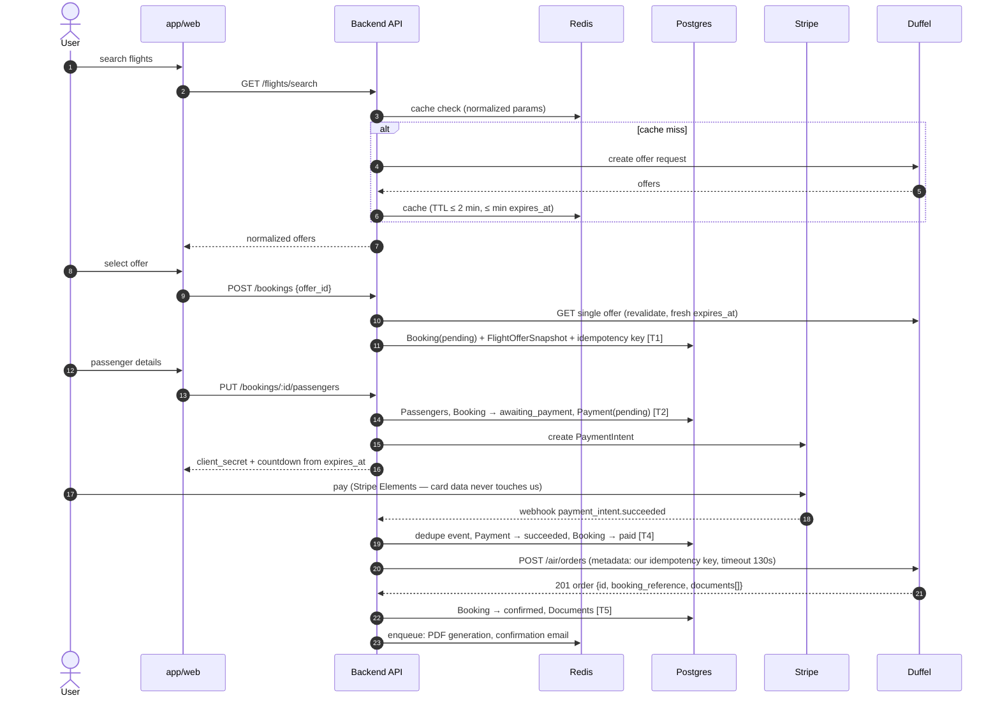
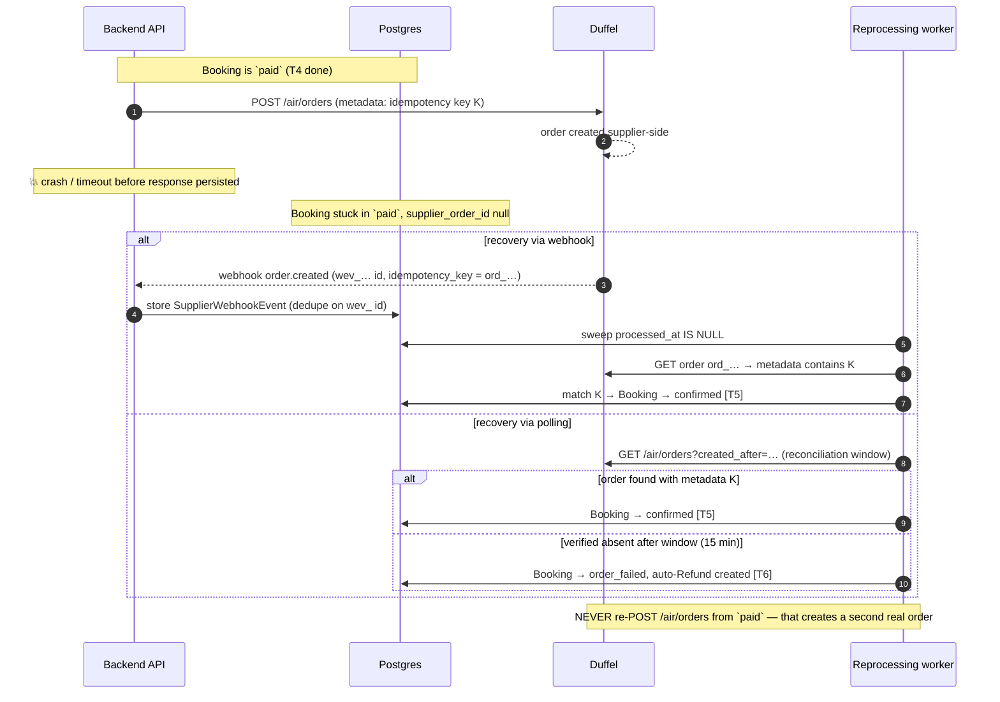
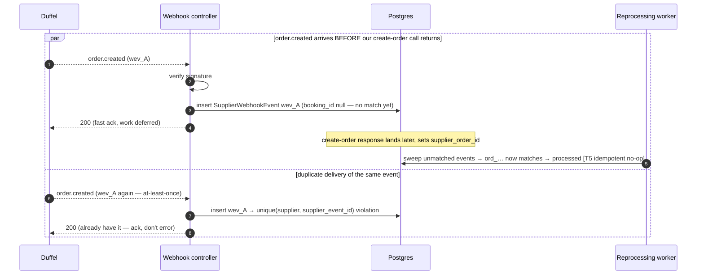
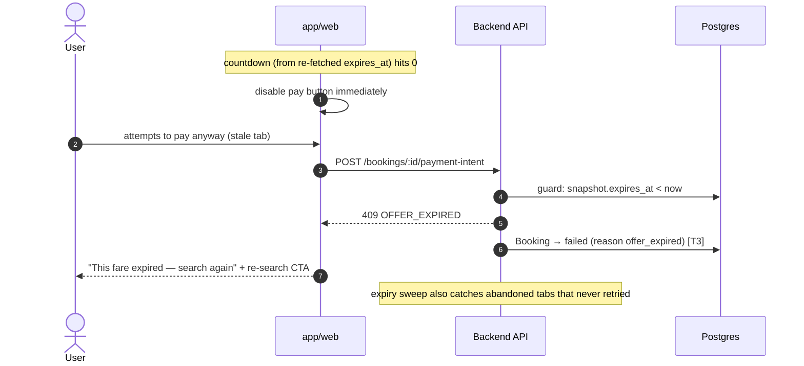
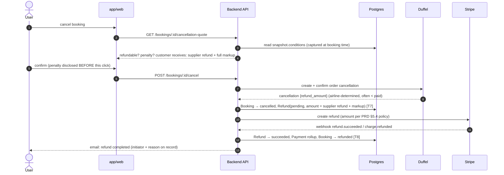
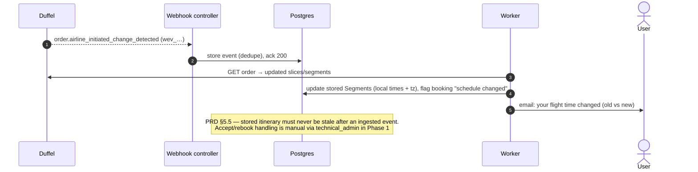
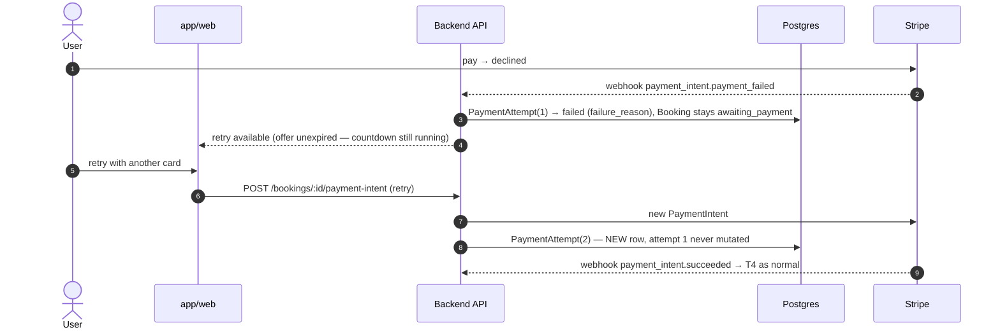

# TravelHub — Sequence Diagrams (Race-Prone Flows)

**Status:** Draft v1
**Inputs:** [booking_state_machine.md](booking_state_machine.md) (transition numbers T1–T9 referenced below), [erd.md](erd.md), [duffel_api_integration_guide.md](duffel_api_integration_guide.md).

These diagrams cover the paths where ordering and failure matter. The happy path is included once for orientation; everything after it is a failure/race scenario the implementation must pass E2E tests for (roadmap §3).

---

## 1. Happy path — search → book → pay → confirm

---

## 2. Crash between payment success and order persistence (the double-book trap)

Duffel has no idempotency key — recovery is reconciliation, never blind retry.

---

## 3. Webhook races: early arrival and duplicate delivery

Same pattern applies to Stripe events via `PaymentWebhookEvent` unique `(provider, provider_event_id)`.

---

## 4. Offer expires mid-checkout

Edge case: payment succeeds in the same second the offer dies → T4 still applies (money is real), then order creation gets a Duffel 4xx → `order_failed` → auto-refund (diagram 2's else-branch). The user is never silently charged for nothing.

---

## 5. Cancellation & refund (user-initiated, auto-approved)

Non-auto-approvable fares route to `technical_admin` after the quote step instead of calling Duffel directly.

---

## 6. Airline schedule change (post-booking supplier event)

---

## 7. Payment failure and retry (offer still alive)

