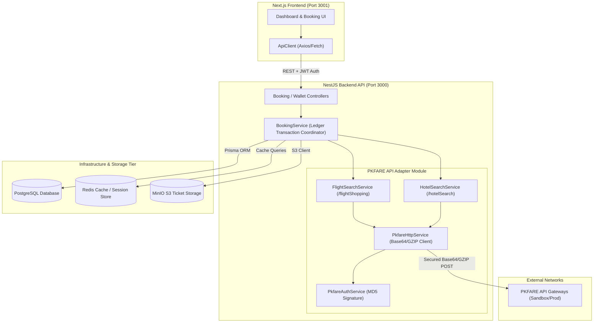
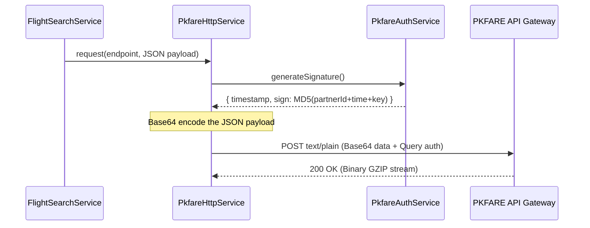

# 🌐 TravelHub B2B Platform: System Design & User Flow

Welcome to the official system architecture and integration blueprint for the **TravelHub B2B Travel Platform**. This document provides an exhaustive overview of the platform's multi-tiered system design, its integration with the **PKFARE API**, complete transaction user flows, and a detailed gap analysis identifying exactly what remains to be built to transition to a 100% production-ready deployment.

---

## 🏛️ 1. High-Level System Architecture

The platform is designed around a modern, decoupled, multi-tier microservice architecture to ensure speed, database transaction safety, and horizontal scaling capability:



### Core Architecture Components:
1. **Next.js Frontend (React)**: High-fidelity, client-rendered admin dashboard that communicates with the API using JSON Web Tokens (JWT) for authentication.
2. **NestJS Backend API (TypeScript)**: Highly scalable Node.js framework that handles rate limiting, roles guards, ledger wallet logic, and the PKFARE adapter module.
3. **Prisma ORM & PostgreSQL**: A robust relational database schema optimized for travel agencies, bookings, and ledger wallet transactions.
4. **Redis Key-Value Cache**: Used to store active flight shopping sessions and flight pricing details to keep page loads under `200ms`.
5. **MinIO (S3 Compatible Storage)**: A private document storage layer that archives generated ticket PDFs and invoice receipts.

---

## 🔒 2. PKFARE API Integration & Protocol Adaptation

The PKFARE integration layer resides in a dedicated, isolated backend module (`PkfareModule`). Since PKFARE utilizes custom payload serialization and compression rules, the gateway adapts these protocols dynamically:

### A. The Request Base64 Serialization Protocol
PKFARE expects all parameters to be serialized into a UTF-8 string and wrapped inside a Base64 payload, posted inside standard text envelopes.



### B. The Response GZIP Decompression Protocol
Because flight search payloads contain massive solution catalogs, PKFARE compresses all HTTP responses in GZIP binary formats:
* **The Decompression Pipeline**: `PkfareHttpService` fetches raw buffer streams (`response.arrayBuffer()`) and processes them via Node's native `zlib.gunzipSync()`.
* **The Graceful Fallback**: If an upstream server error occurs, PKFARE returns uncompressed HTML/JSON error sheets. The adapter catches the decompression exception, falls back to direct UTF-8 decoding, and exposes the exact API error message.

---

## 🔄 3. Core Booking & Safe Transaction User Flows

The core of the platform is the **Double-Entry Wallet Ledgering System** (`WalletService`). It ensures that agency wallets are debited safely and that no money is lost if upstream orders fail.

### ✈️ Complete Flight Booking Sequence:

```mermaid
sequenceDiagram
    autonumber
    actor U as Agent User
    participant F as Frontend UI
    participant C as Booking Controller
    participant B as BookingService (Ledger)
    participant W as WalletService
    participant P as FlightSearchService (PKFARE)
    participant D as PostgreSQL (Prisma)

    U->>F: Search Flights & Click "Book"
    F->>C: POST /bookings/flight (Passenger details + SolutionId)
    C->>B: createFlightBooking(companyId, userId, payload)
    
    rect rgb(20, 30, 45)
        Note right of B: Step 1: Initialize Database Transaction
        B->>D: Create Booking status = PENDING
        B->>W: debitForBooking(companyId, supplierPrice)
        W->>D: Debit Wallet & Create Ledger Entry
    end

    rect rgb(10, 40, 35)
        Note right of B: Step 2: PKFARE Upstream Verification
        B->>P: verifyFlight(solutionId, sessionId)
        P-->>B: Flight verified & price validated
    end

    alt Upstream Verification Success
        B->>P: createOrder() & issueTicket()
        P-->>B: Ticket Issued (PNR, E-Tickets)
        B->>D: Update Booking status = TICKETED, add PNR & details
        B-->>C: Booking Success Response
        C-->>F: Render Ticket Dashboard
    else Upstream Verification/Ticketing Fails
        Note over B, W: Step 3: Transaction Rollback (Wallet Safety)
        B->>W: refundToWallet(companyId, supplierPrice)
        W->>D: Credit Wallet & Create Ledger Refund Entry
        B->>D: Update Booking status = FAILED
        B-->>C: Throw BadRequestException (Refunded successfully)
        C-->>F: Render Failure Page (Credit preserved)
    end
```



---

## 📊 4. Core Database Schema & Ledgering

The ledger ensures **100% financial integrity**. Every balance adjustment is tracked via a double-entry accounting model:

| Field | Type | Description |
| :--- | :--- | :--- |
| `id` | String (UUID) | Unique ledger transaction ID |
| `walletId` | String (UUID) | Target agency wallet |
| `amount` | Decimal | Amount adjusted (+ for credits, - for debits) |
| `type` | Enum | `DEPOSIT`, `DEBIT`, `REFUND`, `MARKUP` |
| `bookingId` | String (UUID) | Linked booking reference |
| `reference` | String | Internal audit trail string |

---

## 🔍 5. Gap Analysis (What is Missing & Remaining Work)

While the core modules are complete and fully operational with mock environments, the following features remain to be implemented to achieve full compliance with professional production standards:

### 🔴 Gap 1: Upstream Pending Order Queue (Ticketing Deadlines)
* **What is missing**: Some PKFARE airline bookings enter a `PENDING` payment state or have manual ticketing reviews with strict deadlines.
* **The Solution**: Implement a **Redis-backed BullMQ Queue** on the NestJS backend to automatically query PKFARE order status every `2 minutes` and send a Discord/Slack alert if the deadline is approaching.

### 🔴 Gap 2: Dynamic Markup & Commission Engine
* **What is missing**: Currently, the platform uses a flat `DEPOSIT_BONUS_PERCENTAGE` env variable. In production, agencies need custom markups depending on the carrier (e.g., higher markup on budget airlines, lower markup on premium long-haul).
* **The Solution**: Implement a `MarkupConfig` table in PostgreSQL mapped to company groups, and modify the `BookingService` to calculate dynamic markups during search results generation.

### 🔴 Gap 3: MinIO S3 Ticket Archive & Direct Download
* **What is missing**: Upstream PKFARE tickets are returned as raw data nodes or links.
* **The Solution**: Construct a PDF generation service using `pdfkit` or `puppeteer`, compile the e-ticket, save it into the MinIO `travel-platform` bucket, and expose a secure download link `GET /bookings/:id/download-ticket` on the frontend.

### 🔴 Gap 4: Real-Time WebSockets Notifications
* **What is missing**: Since ticketing can take up to 2-3 minutes, locking the browser is a bad user experience.
* **The Solution**: Integrate NestJS WebSockets (`Gateway`) so that agents can continue browsing while the backend processes ticketing in the background, firing a toaster notification when the PNR status changes.

---

## ⚡ 6. Quick Startup Checklist (Developer Mode)

To run the B2B platform with the built-in active developer account and bypass auth:

```bash
# 1. Start all infrastructure services
docker-compose up -d

# 2. Synchronize database and generate Prisma Client (shifts port to 5435 to avoid conflicts)
cd app/api
npx prisma db push; npx prisma generate

# 3. Spin up backend API (starts active developer accounts seeder)
npm run start:dev

# 4. Spin up Next.js frontend (in app/web)
npm run dev
```

* **Interactive Swagger Documentation**: Open `http://localhost:3000/docs` to test endpoints.
* **Auto-Login**: Go to `http://localhost:3001/login` and click **Autofill Developer Demo Credentials** to bypass login gates instantly!

---

> [!NOTE]
> This system is designed for high-availability. Under failure states, the platform prioritizes **wallet security and ledger locking** over all else to ensure no financial slippage occurs.
