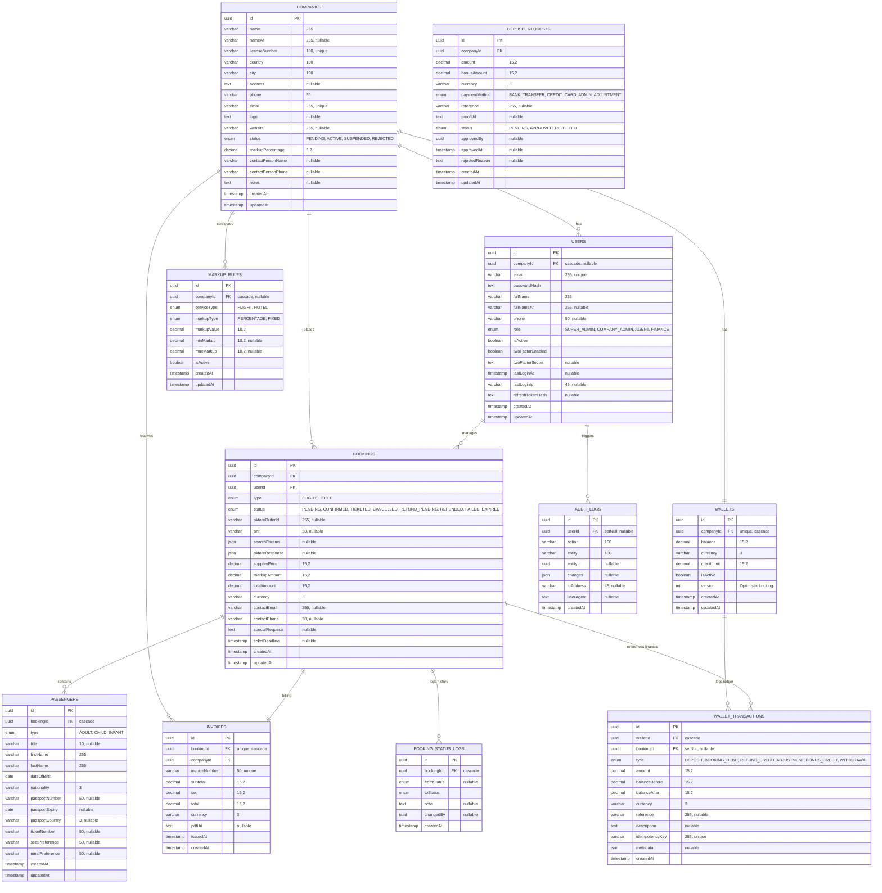
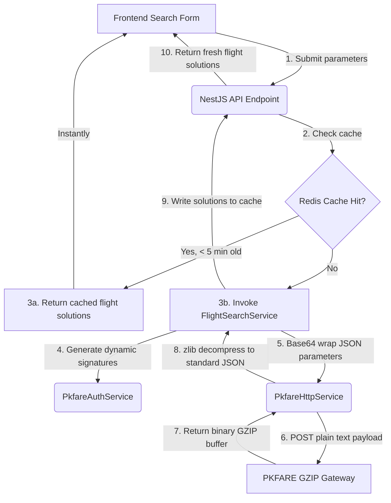
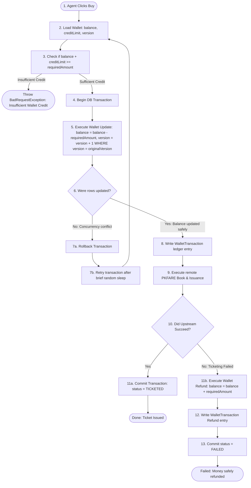

# 📊 Visual System Documentation & Database ERD

This document provides a highly visual, interactive, and comprehensive breakdown of the **TravelHub B2B Platform** database schema (Entity Relationship Diagram) and core visual data flow architectures.

---

## 🗄️ 1. Entity Relationship Diagram (ERD)

The database schema is built on **PostgreSQL** and orchestrated using **Prisma**. Below is the complete interactive ERD illustrating all tables, fields, data types, and structural relationships (1-to-1, 1-to-many, nullable connections):

---

## 🔄 2. Core Visual System Data Flows

### A. Dynamic Search Cache & Upstream Dispatcher
This flow maps out how search requests utilize **Redis caching** to save latency times before performing full PKFARE upstream GZIP downloads:

---

## 💰 3. B2B Wallet Ledgering Lifecycle (Optimistic Locking Protection)

To prevent double-spending in concurrency scenarios (e.g. multiple agents in the same company attempting to purchase different seats simultaneously), the platform uses **Optimistic Locking** on the Wallet entity:

---

> [!TIP]
> **Optimistic locking version checks** completely prevent race conditions during high-volume periods without incurring heavy database row-level locking performance penalties.
